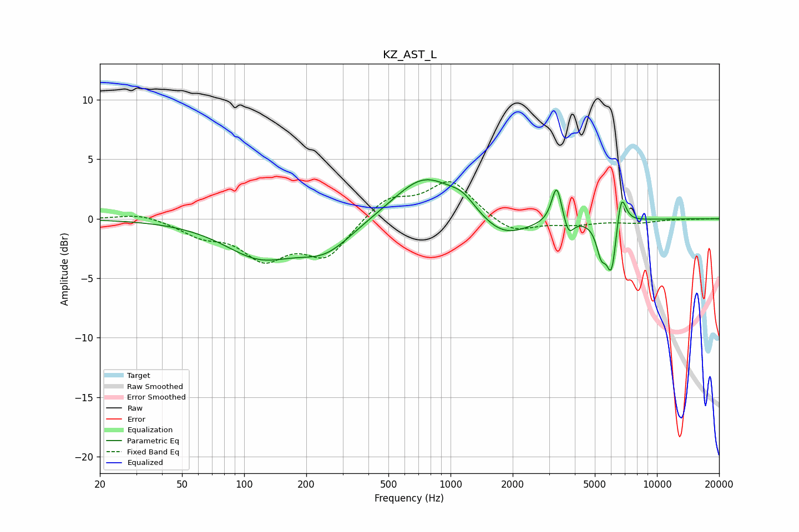

# KZ_AST_L
See [usage instructions](https://github.com/jaakkopasanen/AutoEq#usage) for more options and info.

### Parametric EQs
Apply preamp of -3.4 dB when using parametric equalizer.

|   # | Type    |   Fc (Hz) |    Q |   Gain (dB) |
|-----|---------|-----------|------|-------------|
|   1 | Peaking |       119 | 0.82 |        -3   |
|   2 | Peaking |       248 | 1.07 |        -2.3 |
|   3 | Peaking |       747 | 0.96 |         3.7 |
|   4 | Peaking |      1147 | 2.15 |         1.1 |
|   5 | Peaking |      1789 | 1.16 |        -1.9 |
|   6 | Peaking |      3268 | 5.85 |         3.2 |
|   7 | Peaking |      3731 | 6    |        -1.4 |
|   8 | Peaking |      5368 | 6    |        -2.3 |
|   9 | Peaking |      6028 | 5.56 |        -4.5 |
|  10 | Peaking |      6702 | 5.84 |         3.1 |

### Fixed Band EQs
When using fixed band (also called graphic) equalizer, apply preamp of **-3.2 dB** (if available) and set gains manually with these parameters.

|   # | Type    |   Fc (Hz) |    Q |   Gain (dB) |
|-----|---------|-----------|------|-------------|
|   1 | Peaking |        31 | 1.41 |         0.5 |
|   2 | Peaking |        62 | 1.41 |        -1.2 |
|   3 | Peaking |       125 | 1.41 |        -3.1 |
|   4 | Peaking |       250 | 1.41 |        -3.1 |
|   5 | Peaking |       500 | 1.41 |         1.8 |
|   6 | Peaking |      1000 | 1.41 |         3.1 |
|   7 | Peaking |      2000 | 1.41 |        -1.3 |
|   8 | Peaking |      4000 | 1.41 |        -0.4 |
|   9 | Peaking |      8000 | 1.41 |        -0.3 |
|  10 | Peaking |     16000 | 1.41 |        -0   |

### Graphs

