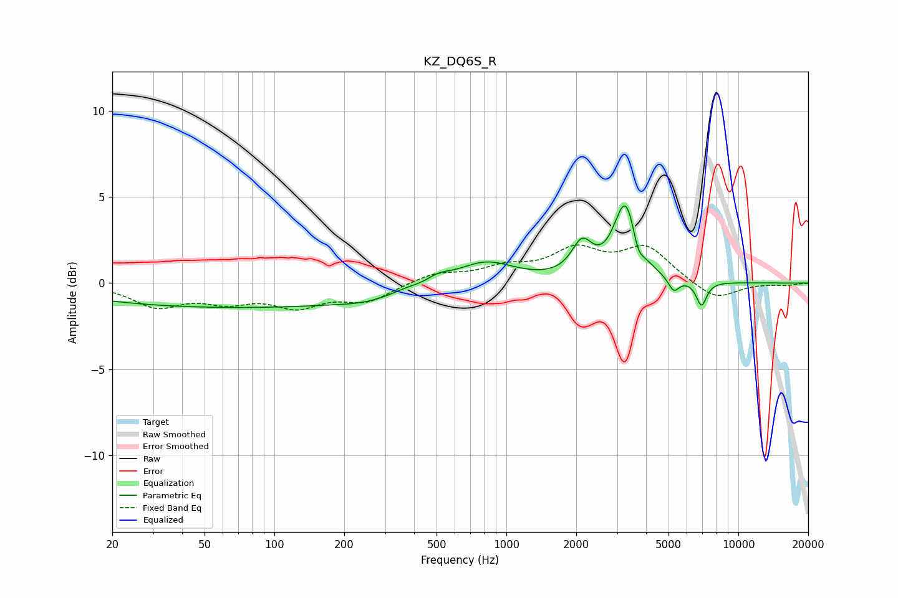

# KZ_DQ6S_R
See [usage instructions](https://github.com/jaakkopasanen/AutoEq#usage) for more options and info.

### Parametric EQs
Apply preamp of -4.6 dB when using parametric equalizer.

|   # | Type    |   Fc (Hz) |    Q |   Gain (dB) |
|-----|---------|-----------|------|-------------|
|   1 | Peaking |        71 | 0.18 |        -1.4 |
|   2 | Peaking |       243 | 1.44 |        -0.2 |
|   3 | Peaking |       369 | 2.5  |         0.2 |
|   4 | Peaking |       510 | 2.77 |         0.4 |
|   5 | Peaking |       806 | 1.1  |         1.4 |
|   6 | Peaking |      2118 | 3.18 |         1.9 |
|   7 | Peaking |      3270 | 2.84 |         4.6 |
|   8 | Peaking |      3688 | 5.94 |        -1.1 |
|   9 | Peaking |      5263 | 5.98 |        -0.8 |
|  10 | Peaking |      6935 | 6    |        -1.4 |

### Fixed Band EQs
When using fixed band (also called graphic) equalizer, apply preamp of **-2.3 dB** (if available) and set gains manually with these parameters.

|   # | Type    |   Fc (Hz) |    Q |   Gain (dB) |
|-----|---------|-----------|------|-------------|
|   1 | Peaking |        31 | 1.41 |        -1.3 |
|   2 | Peaking |        62 | 1.41 |        -0.9 |
|   3 | Peaking |       125 | 1.41 |        -1.2 |
|   4 | Peaking |       250 | 1.41 |        -1   |
|   5 | Peaking |       500 | 1.41 |         0.6 |
|   6 | Peaking |      1000 | 1.41 |         0.8 |
|   7 | Peaking |      2000 | 1.41 |         1.7 |
|   8 | Peaking |      4000 | 1.41 |         2   |
|   9 | Peaking |      8000 | 1.41 |        -1   |
|  10 | Peaking |     16000 | 1.41 |        -0.1 |

### Graphs

