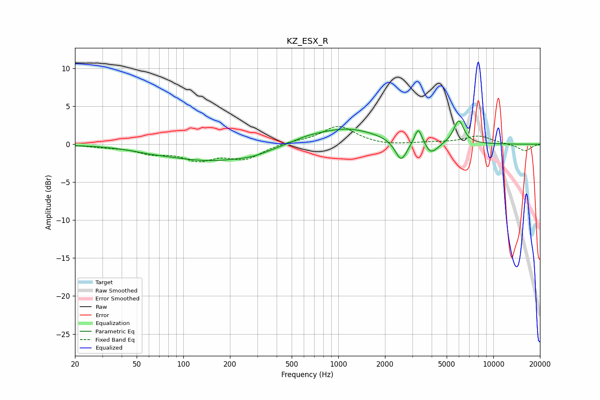

# KZ_ESX_R
See [usage instructions](https://github.com/jaakkopasanen/AutoEq#usage) for more options and info.

### Parametric EQs
Apply preamp of -3.2 dB when using parametric equalizer.

|   # | Type    |   Fc (Hz) |    Q |   Gain (dB) |
|-----|---------|-----------|------|-------------|
|   1 | Peaking |        61 | 1.19 |        -0.2 |
|   2 | Peaking |       152 | 0.48 |        -2.1 |
|   3 | Peaking |       282 | 1.53 |        -0.4 |
|   4 | Peaking |       620 | 1.53 |         0.4 |
|   5 | Peaking |      1123 | 0.68 |         2.1 |
|   6 | Peaking |      2540 | 3.7  |        -2.8 |
|   7 | Peaking |      3278 | 6    |         2.2 |
|   8 | Peaking |      3925 | 4.27 |        -1.2 |
|   9 | Peaking |      4304 | 3.46 |        -0.5 |
|  10 | Peaking |      5982 | 4.23 |         3.1 |

### Fixed Band EQs
When using fixed band (also called graphic) equalizer, apply preamp of **-2.4 dB** (if available) and set gains manually with these parameters.

|   # | Type    |   Fc (Hz) |    Q |   Gain (dB) |
|-----|---------|-----------|------|-------------|
|   1 | Peaking |        31 | 1.41 |        -0.3 |
|   2 | Peaking |        62 | 1.41 |        -1   |
|   3 | Peaking |       125 | 1.41 |        -1.8 |
|   4 | Peaking |       250 | 1.41 |        -1.8 |
|   5 | Peaking |       500 | 1.41 |         0.3 |
|   6 | Peaking |      1000 | 1.41 |         2.4 |
|   7 | Peaking |      2000 | 1.41 |        -0.2 |
|   8 | Peaking |      4000 | 1.41 |         0.2 |
|   9 | Peaking |      8000 | 1.41 |         1.1 |
|  10 | Peaking |     16000 | 1.41 |        -0.9 |

### Graphs

