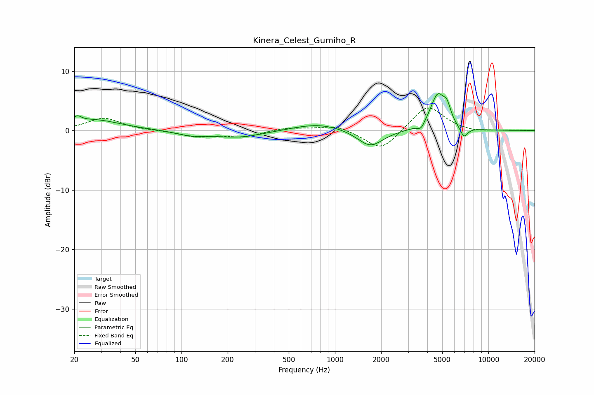

# Kinera_Celest_Gumiho_R
See [usage instructions](https://github.com/jaakkopasanen/AutoEq#usage) for more options and info.

### Parametric EQs
Apply preamp of -6.3 dB when using parametric equalizer.

|   # | Type    |   Fc (Hz) |    Q |   Gain (dB) |
|-----|---------|-----------|------|-------------|
|   1 | Peaking |        21 | 5.52 |         1   |
|   2 | Peaking |        27 | 0.81 |         1.8 |
|   3 | Peaking |       115 | 1.45 |        -0.7 |
|   4 | Peaking |       238 | 0.86 |        -1.2 |
|   5 | Peaking |       781 | 0.83 |         1.3 |
|   6 | Peaking |      1697 | 1.68 |        -2.9 |
|   7 | Peaking |      3637 | 6    |        -1.1 |
|   8 | Peaking |      4677 | 2.88 |         5.9 |
|   9 | Peaking |      5376 | 5.82 |         2.2 |
|  10 | Peaking |      6923 | 5.45 |        -1.8 |

### Fixed Band EQs
When using fixed band (also called graphic) equalizer, apply preamp of **-3.9 dB** (if available) and set gains manually with these parameters.

|   # | Type    |   Fc (Hz) |    Q |   Gain (dB) |
|-----|---------|-----------|------|-------------|
|   1 | Peaking |        31 | 1.41 |         2.1 |
|   2 | Peaking |        62 | 1.41 |        -0   |
|   3 | Peaking |       125 | 1.41 |        -1   |
|   4 | Peaking |       250 | 1.41 |        -1   |
|   5 | Peaking |       500 | 1.41 |         0.5 |
|   6 | Peaking |      1000 | 1.41 |         1   |
|   7 | Peaking |      2000 | 1.41 |        -3.5 |
|   8 | Peaking |      4000 | 1.41 |         4.4 |
|   9 | Peaking |      8000 | 1.41 |        -0.3 |
|  10 | Peaking |     16000 | 1.41 |         0   |

### Graphs

