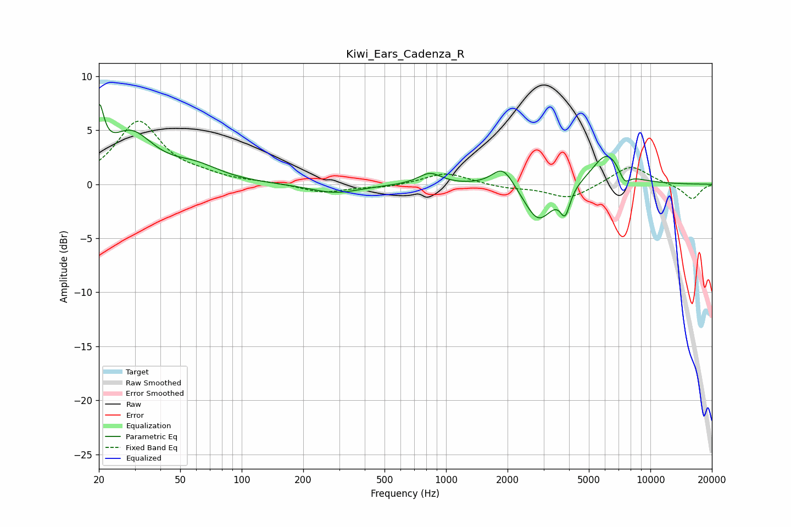

# Kiwi_Ears_Cadenza_R
See [usage instructions](https://github.com/jaakkopasanen/AutoEq#usage) for more options and info.

### Parametric EQs
Apply preamp of -7.5 dB when using parametric equalizer.

|   # | Type    |   Fc (Hz) |    Q |   Gain (dB) |
|-----|---------|-----------|------|-------------|
|   1 | Peaking |        20 | 5.94 |         4.9 |
|   2 | Peaking |        28 | 1.26 |         4.5 |
|   3 | Peaking |        59 | 1.16 |         1.3 |
|   4 | Peaking |       286 | 1.14 |        -0.8 |
|   5 | Peaking |       834 | 2.52 |         1.1 |
|   6 | Peaking |      1900 | 2.65 |         2   |
|   7 | Peaking |      2833 | 2.04 |        -3.5 |
|   8 | Peaking |      3828 | 5.91 |        -2.3 |
|   9 | Peaking |      6148 | 1.87 |         3.1 |
|  10 | Peaking |      7461 | 4.74 |        -1.2 |

### Fixed Band EQs
When using fixed band (also called graphic) equalizer, apply preamp of **-5.9 dB** (if available) and set gains manually with these parameters.

|   # | Type    |   Fc (Hz) |    Q |   Gain (dB) |
|-----|---------|-----------|------|-------------|
|   1 | Peaking |        31 | 1.41 |         5.7 |
|   2 | Peaking |        62 | 1.41 |         0.6 |
|   3 | Peaking |       125 | 1.41 |         0.1 |
|   4 | Peaking |       250 | 1.41 |        -0.8 |
|   5 | Peaking |       500 | 1.41 |        -0.3 |
|   6 | Peaking |      1000 | 1.41 |         1.1 |
|   7 | Peaking |      2000 | 1.41 |        -0.3 |
|   8 | Peaking |      4000 | 1.41 |        -1.4 |
|   9 | Peaking |      8000 | 1.41 |         1.8 |
|  10 | Peaking |     16000 | 1.41 |        -1.4 |

### Graphs

