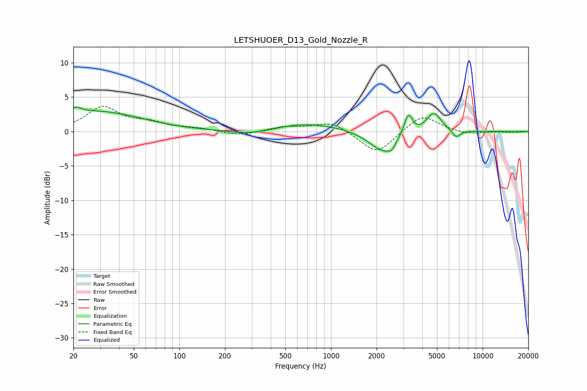

# LETSHUOER_D13_Gold_Nozzle_R
See [usage instructions](https://github.com/jaakkopasanen/AutoEq#usage) for more options and info.

### Parametric EQs
Apply preamp of -3.6 dB when using parametric equalizer.

|   # | Type    |   Fc (Hz) |    Q |   Gain (dB) |
|-----|---------|-----------|------|-------------|
|   1 | Peaking |        21 | 4.48 |         0.7 |
|   2 | Peaking |       103 | 0.18 |         9.7 |
|   3 | Peaking |       103 | 0.31 |        -8.2 |
|   4 | Peaking |       310 | 0.65 |        -2.9 |
|   5 | Peaking |      2263 | 1.47 |        -3.6 |
|   6 | Peaking |      2513 | 6    |        -0.8 |
|   7 | Peaking |      2644 | 2.13 |         0.6 |
|   8 | Peaking |      3231 | 5.26 |         3.1 |
|   9 | Peaking |      4761 | 2.83 |         2.9 |
|  10 | Peaking |      6698 | 5.26 |        -1.1 |

### Fixed Band EQs
When using fixed band (also called graphic) equalizer, apply preamp of **-3.8 dB** (if available) and set gains manually with these parameters.

|   # | Type    |   Fc (Hz) |    Q |   Gain (dB) |
|-----|---------|-----------|------|-------------|
|   1 | Peaking |        31 | 1.41 |         3.5 |
|   2 | Peaking |        62 | 1.41 |         1.1 |
|   3 | Peaking |       125 | 1.41 |         0.4 |
|   4 | Peaking |       250 | 1.41 |        -0.6 |
|   5 | Peaking |       500 | 1.41 |         0.7 |
|   6 | Peaking |      1000 | 1.41 |         1.5 |
|   7 | Peaking |      2000 | 1.41 |        -3.4 |
|   8 | Peaking |      4000 | 1.41 |         2.6 |
|   9 | Peaking |      8000 | 1.41 |        -0.4 |
|  10 | Peaking |     16000 | 1.41 |        -0.2 |

### Graphs

