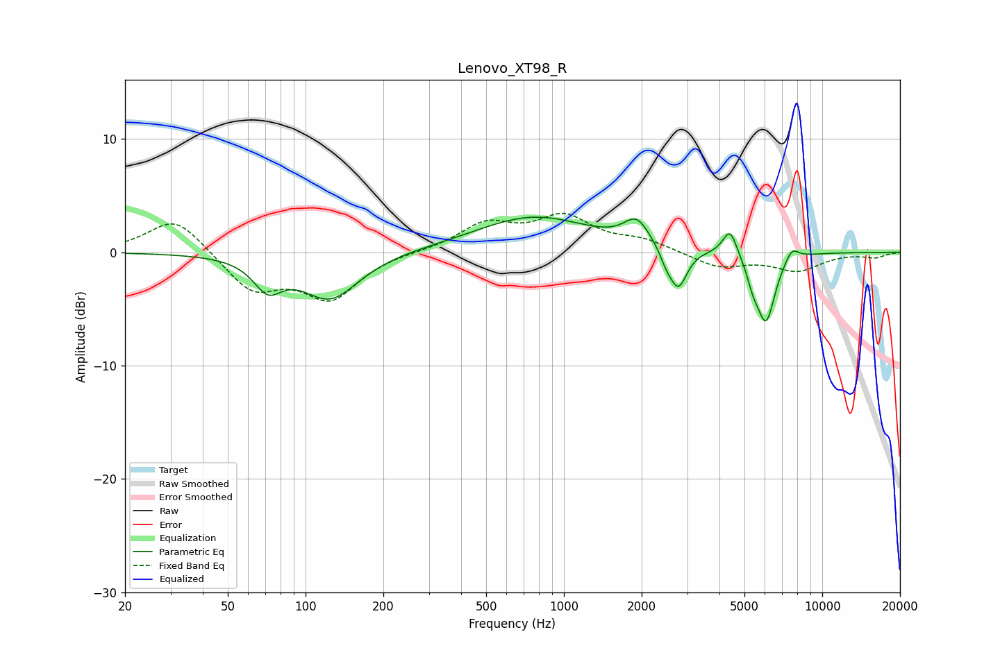

# Lenovo_XT98_R
See [usage instructions](https://github.com/jaakkopasanen/AutoEq#usage) for more options and info.

### Parametric EQs
Apply preamp of -3.2 dB when using parametric equalizer.

|   # | Type    |   Fc (Hz) |    Q |   Gain (dB) |
|-----|---------|-----------|------|-------------|
|   1 | Peaking |        71 | 2.6  |        -2.5 |
|   2 | Peaking |       124 | 1.27 |        -4.1 |
|   3 | Peaking |       763 | 0.63 |         3.1 |
|   4 | Peaking |      1915 | 2.85 |         2.2 |
|   5 | Peaking |      2491 | 5.73 |        -1   |
|   6 | Peaking |      2772 | 4.16 |        -3.5 |
|   7 | Peaking |      4396 | 4.97 |         2.4 |
|   8 | Peaking |      5398 | 6    |        -1.4 |
|   9 | Peaking |      6057 | 3.81 |        -6   |
|  10 | Peaking |      7629 | 5.09 |         1.1 |

### Fixed Band EQs
When using fixed band (also called graphic) equalizer, apply preamp of **-3.5 dB** (if available) and set gains manually with these parameters.

|   # | Type    |   Fc (Hz) |    Q |   Gain (dB) |
|-----|---------|-----------|------|-------------|
|   1 | Peaking |        31 | 1.41 |         3.2 |
|   2 | Peaking |        62 | 1.41 |        -3.3 |
|   3 | Peaking |       125 | 1.41 |        -3.9 |
|   4 | Peaking |       250 | 1.41 |         0.1 |
|   5 | Peaking |       500 | 1.41 |         2.4 |
|   6 | Peaking |      1000 | 1.41 |         2.9 |
|   7 | Peaking |      2000 | 1.41 |         0.9 |
|   8 | Peaking |      4000 | 1.41 |        -1.3 |
|   9 | Peaking |      8000 | 1.41 |        -1.5 |
|  10 | Peaking |     16000 | 1.41 |        -0.4 |

### Graphs

