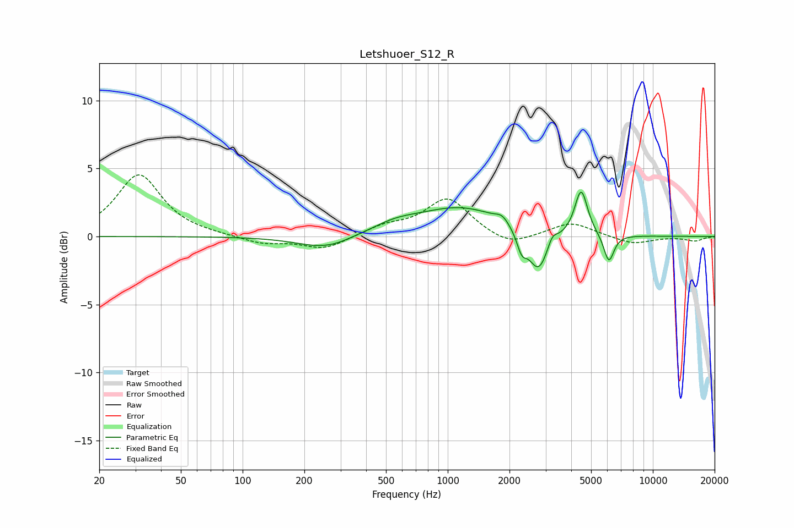

# Letshuoer_S12_R
See [usage instructions](https://github.com/jaakkopasanen/AutoEq#usage) for more options and info.

### Parametric EQs
Apply preamp of -3.4 dB when using parametric equalizer.

|   # | Type    |   Fc (Hz) |    Q |   Gain (dB) |
|-----|---------|-----------|------|-------------|
|   1 | Peaking |       248 | 1.05 |        -0.9 |
|   2 | Peaking |       286 | 1.81 |        -0.1 |
|   3 | Peaking |       553 | 1.25 |         0.6 |
|   4 | Peaking |      1170 | 0.65 |         2.1 |
|   5 | Peaking |      1843 | 4.48 |         0.5 |
|   6 | Peaking |      2295 | 6    |        -1.3 |
|   7 | Peaking |      2770 | 2.84 |        -3.1 |
|   8 | Peaking |      3229 | 6    |         0.8 |
|   9 | Peaking |      4471 | 4.53 |         3.4 |
|  10 | Peaking |      6102 | 5.53 |        -2.1 |

### Fixed Band EQs
When using fixed band (also called graphic) equalizer, apply preamp of **-4.6 dB** (if available) and set gains manually with these parameters.

|   # | Type    |   Fc (Hz) |    Q |   Gain (dB) |
|-----|---------|-----------|------|-------------|
|   1 | Peaking |        31 | 1.41 |         4.5 |
|   2 | Peaking |        62 | 1.41 |         0.1 |
|   3 | Peaking |       125 | 1.41 |        -0.5 |
|   4 | Peaking |       250 | 1.41 |        -0.9 |
|   5 | Peaking |       500 | 1.41 |         0.7 |
|   6 | Peaking |      1000 | 1.41 |         2.8 |
|   7 | Peaking |      2000 | 1.41 |        -0.8 |
|   8 | Peaking |      4000 | 1.41 |         1   |
|   9 | Peaking |      8000 | 1.41 |        -0.6 |
|  10 | Peaking |     16000 | 1.41 |        -0.3 |

### Graphs

