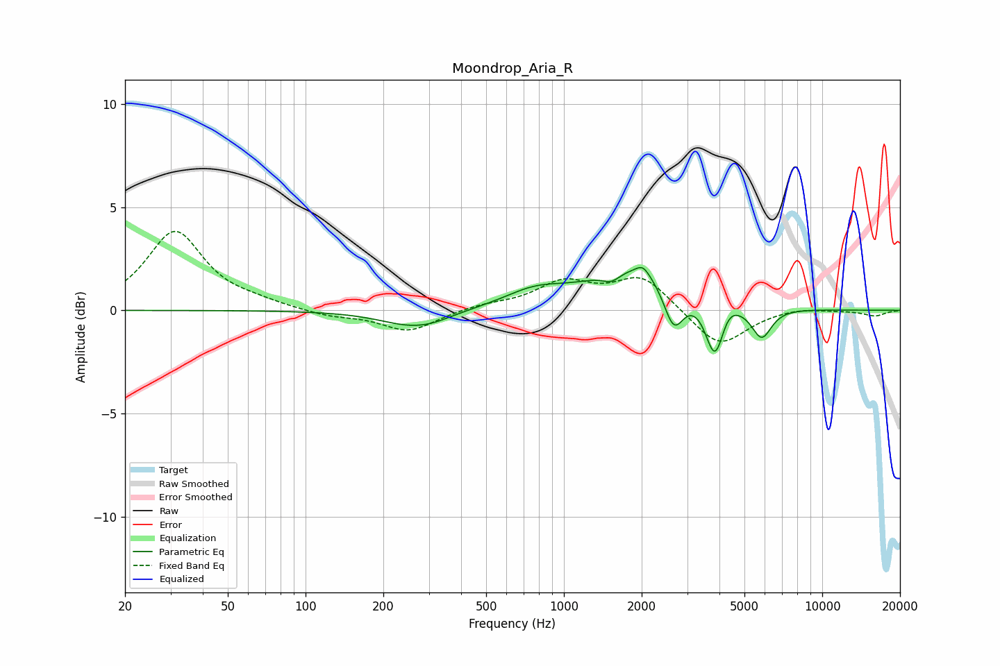

# Moondrop_Aria_R
See [usage instructions](https://github.com/jaakkopasanen/AutoEq#usage) for more options and info.

### Parametric EQs
Apply preamp of -2.2 dB when using parametric equalizer.

|   # | Type    |   Fc (Hz) |    Q |   Gain (dB) |
|-----|---------|-----------|------|-------------|
|   1 | Peaking |       258 | 1.14 |        -0.7 |
|   2 | Peaking |       314 | 1.83 |        -0.2 |
|   3 | Peaking |       773 | 1.18 |         0.8 |
|   4 | Peaking |      1527 | 4.03 |        -0.4 |
|   5 | Peaking |      1945 | 0.8  |         2.1 |
|   6 | Peaking |      2023 | 5.35 |         0.5 |
|   7 | Peaking |      2660 | 3.63 |        -2.1 |
|   8 | Peaking |      3844 | 3.94 |        -2.8 |
|   9 | Peaking |      4296 | 3.68 |         0.6 |
|  10 | Peaking |      5827 | 3.59 |        -1.5 |

### Fixed Band EQs
When using fixed band (also called graphic) equalizer, apply preamp of **-3.9 dB** (if available) and set gains manually with these parameters.

|   # | Type    |   Fc (Hz) |    Q |   Gain (dB) |
|-----|---------|-----------|------|-------------|
|   1 | Peaking |        31 | 1.41 |         3.8 |
|   2 | Peaking |        62 | 1.41 |         0.3 |
|   3 | Peaking |       125 | 1.41 |        -0.3 |
|   4 | Peaking |       250 | 1.41 |        -1   |
|   5 | Peaking |       500 | 1.41 |         0.2 |
|   6 | Peaking |      1000 | 1.41 |         1.3 |
|   7 | Peaking |      2000 | 1.41 |         1.6 |
|   8 | Peaking |      4000 | 1.41 |        -1.8 |
|   9 | Peaking |      8000 | 1.41 |         0.2 |
|  10 | Peaking |     16000 | 1.41 |        -0.3 |

### Graphs

