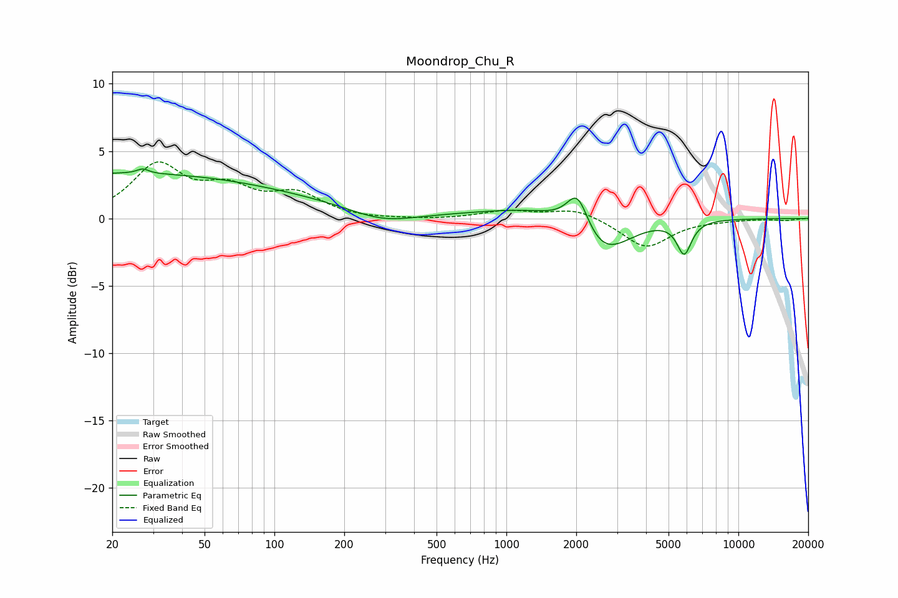

# Moondrop_Chu_R
See [usage instructions](https://github.com/jaakkopasanen/AutoEq#usage) for more options and info.

### Parametric EQs
Apply preamp of -3.8 dB when using parametric equalizer.

|   # | Type    |   Fc (Hz) |    Q |   Gain (dB) |
|-----|---------|-----------|------|-------------|
|   1 | Peaking |        22 | 0.19 |         3.3 |
|   2 | Peaking |        27 | 5.93 |         0.3 |
|   3 | Peaking |       182 | 0.49 |         0.5 |
|   4 | Peaking |       283 | 1    |        -0.7 |
|   5 | Peaking |       332 | 0.91 |        -0.5 |
|   6 | Peaking |       344 | 0.85 |         0.3 |
|   7 | Peaking |      1763 | 0.51 |         1.3 |
|   8 | Peaking |      2029 | 2.97 |         2.9 |
|   9 | Peaking |      2572 | 1.14 |        -3.7 |
|  10 | Peaking |      5841 | 4.44 |        -2.4 |

### Fixed Band EQs
When using fixed band (also called graphic) equalizer, apply preamp of **-4.3 dB** (if available) and set gains manually with these parameters.

|   # | Type    |   Fc (Hz) |    Q |   Gain (dB) |
|-----|---------|-----------|------|-------------|
|   1 | Peaking |        31 | 1.41 |         3.8 |
|   2 | Peaking |        62 | 1.41 |         1.9 |
|   3 | Peaking |       125 | 1.41 |         1.6 |
|   4 | Peaking |       250 | 1.41 |        -0.1 |
|   5 | Peaking |       500 | 1.41 |        -0.1 |
|   6 | Peaking |      1000 | 1.41 |         0.5 |
|   7 | Peaking |      2000 | 1.41 |         0.8 |
|   8 | Peaking |      4000 | 1.41 |        -2.2 |
|   9 | Peaking |      8000 | 1.41 |        -0.1 |
|  10 | Peaking |     16000 | 1.41 |        -0.1 |

### Graphs

