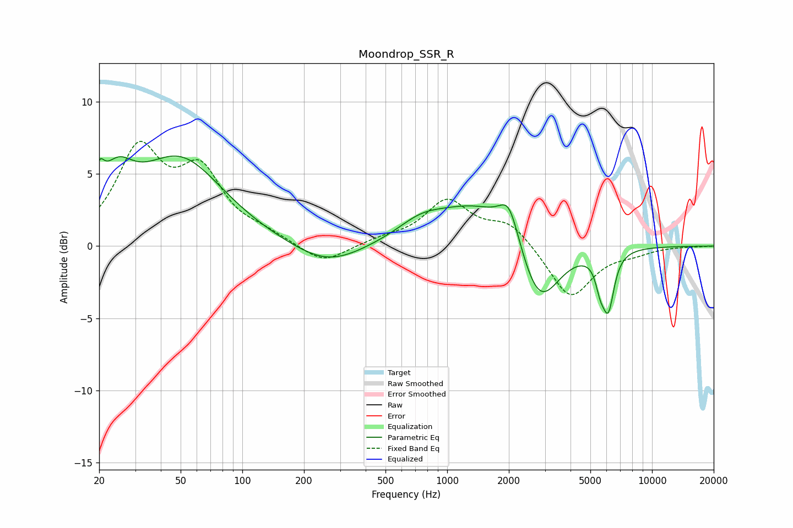

# Moondrop_SSR_R
See [usage instructions](https://github.com/jaakkopasanen/AutoEq#usage) for more options and info.

### Parametric EQs
Apply preamp of -6.3 dB when using parametric equalizer.

|   # | Type    |   Fc (Hz) |    Q |   Gain (dB) |
|-----|---------|-----------|------|-------------|
|   1 | Peaking |        20 | 5.91 |         1.9 |
|   2 | Peaking |        24 | 1.79 |         3   |
|   3 | Peaking |        50 | 0.67 |         5.9 |
|   4 | Peaking |       261 | 0.83 |        -1.6 |
|   5 | Peaking |       743 | 1.25 |         1   |
|   6 | Peaking |      1477 | 0.65 |         3.1 |
|   7 | Peaking |      2006 | 2.91 |         2.5 |
|   8 | Peaking |      2806 | 1.4  |        -5.2 |
|   9 | Peaking |      5587 | 6    |        -1.5 |
|  10 | Peaking |      6120 | 4.88 |        -3.7 |

### Fixed Band EQs
When using fixed band (also called graphic) equalizer, apply preamp of **-7.3 dB** (if available) and set gains manually with these parameters.

|   # | Type    |   Fc (Hz) |    Q |   Gain (dB) |
|-----|---------|-----------|------|-------------|
|   1 | Peaking |        31 | 1.41 |         6.3 |
|   2 | Peaking |        62 | 1.41 |         4.6 |
|   3 | Peaking |       125 | 1.41 |         0.6 |
|   4 | Peaking |       250 | 1.41 |        -1.3 |
|   5 | Peaking |       500 | 1.41 |         0.4 |
|   6 | Peaking |      1000 | 1.41 |         3   |
|   7 | Peaking |      2000 | 1.41 |         1.6 |
|   8 | Peaking |      4000 | 1.41 |        -3.7 |
|   9 | Peaking |      8000 | 1.41 |        -0.4 |
|  10 | Peaking |     16000 | 1.41 |        -0   |

### Graphs

