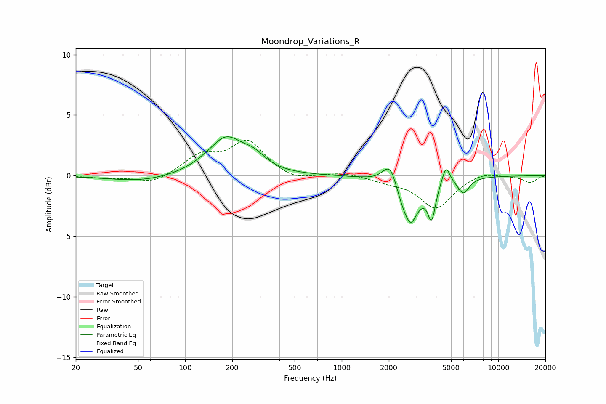

# Moondrop_Variations_R
See [usage instructions](https://github.com/jaakkopasanen/AutoEq#usage) for more options and info.

### Parametric EQs
Apply preamp of -3.3 dB when using parametric equalizer.

|   # | Type    |   Fc (Hz) |    Q |   Gain (dB) |
|-----|---------|-----------|------|-------------|
|   1 | Peaking |        53 | 0.7  |        -0.5 |
|   2 | Peaking |       155 | 2.48 |        -0.2 |
|   3 | Peaking |       178 | 1.25 |         3.2 |
|   4 | Peaking |       275 | 1.9  |         0.9 |
|   5 | Peaking |      2052 | 2.92 |         2.3 |
|   6 | Peaking |      2645 | 1.88 |        -3.7 |
|   7 | Peaking |      2777 | 5.88 |        -0.6 |
|   8 | Peaking |      3753 | 5.96 |        -2.6 |
|   9 | Peaking |      4635 | 5.65 |         1.6 |
|  10 | Peaking |      5991 | 3.86 |        -1.3 |

### Fixed Band EQs
When using fixed band (also called graphic) equalizer, apply preamp of **-3.0 dB** (if available) and set gains manually with these parameters.

|   # | Type    |   Fc (Hz) |    Q |   Gain (dB) |
|-----|---------|-----------|------|-------------|
|   1 | Peaking |        31 | 1.41 |        -0.2 |
|   2 | Peaking |        62 | 1.41 |        -0.7 |
|   3 | Peaking |       125 | 1.41 |         1.5 |
|   4 | Peaking |       250 | 1.41 |         2.8 |
|   5 | Peaking |       500 | 1.41 |        -0.5 |
|   6 | Peaking |      1000 | 1.41 |         0.3 |
|   7 | Peaking |      2000 | 1.41 |        -0.4 |
|   8 | Peaking |      4000 | 1.41 |        -2.7 |
|   9 | Peaking |      8000 | 1.41 |         0.4 |
|  10 | Peaking |     16000 | 1.41 |        -0.6 |

### Graphs

