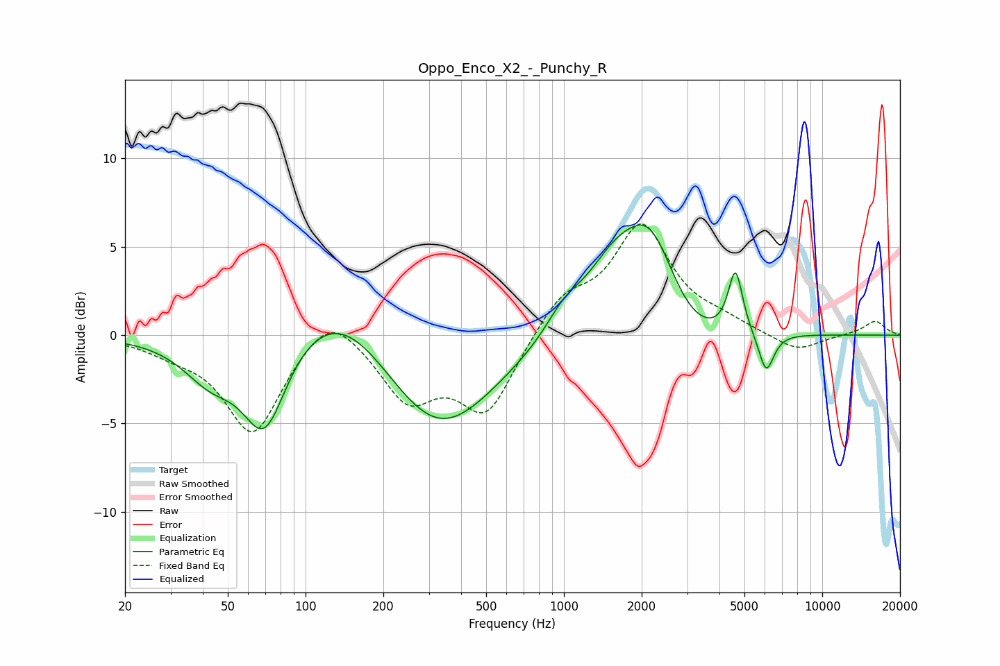

# Oppo_Enco_X2_-_Punchy_R
See [usage instructions](https://github.com/jaakkopasanen/AutoEq#usage) for more options and info.

### Parametric EQs
Apply preamp of -6.3 dB when using parametric equalizer.

|   # | Type    |   Fc (Hz) |    Q |   Gain (dB) |
|-----|---------|-----------|------|-------------|
|   1 | Peaking |        43 | 1.32 |        -2.2 |
|   2 | Peaking |        69 | 1.67 |        -5.4 |
|   3 | Peaking |       136 | 0.71 |         3.2 |
|   4 | Peaking |       324 | 0.65 |        -5.9 |
|   5 | Peaking |      1003 | 1.93 |         1.4 |
|   6 | Peaking |      1535 | 1.31 |         2.7 |
|   7 | Peaking |      2176 | 1.24 |         6.4 |
|   8 | Peaking |      2914 | 1.02 |        -2.4 |
|   9 | Peaking |      4615 | 5.05 |         3.6 |
|  10 | Peaking |      6068 | 4.63 |        -2.3 |

### Fixed Band EQs
When using fixed band (also called graphic) equalizer, apply preamp of **-6.4 dB** (if available) and set gains manually with these parameters.

|   # | Type    |   Fc (Hz) |    Q |   Gain (dB) |
|-----|---------|-----------|------|-------------|
|   1 | Peaking |        31 | 1.41 |        -0.7 |
|   2 | Peaking |        62 | 1.41 |        -5.5 |
|   3 | Peaking |       125 | 1.41 |         1.9 |
|   4 | Peaking |       250 | 1.41 |        -3.4 |
|   5 | Peaking |       500 | 1.41 |        -4.3 |
|   6 | Peaking |      1000 | 1.41 |         2.1 |
|   7 | Peaking |      2000 | 1.41 |         6   |
|   8 | Peaking |      4000 | 1.41 |         0.6 |
|   9 | Peaking |      8000 | 1.41 |        -1   |
|  10 | Peaking |     16000 | 1.41 |         0.8 |

### Graphs

