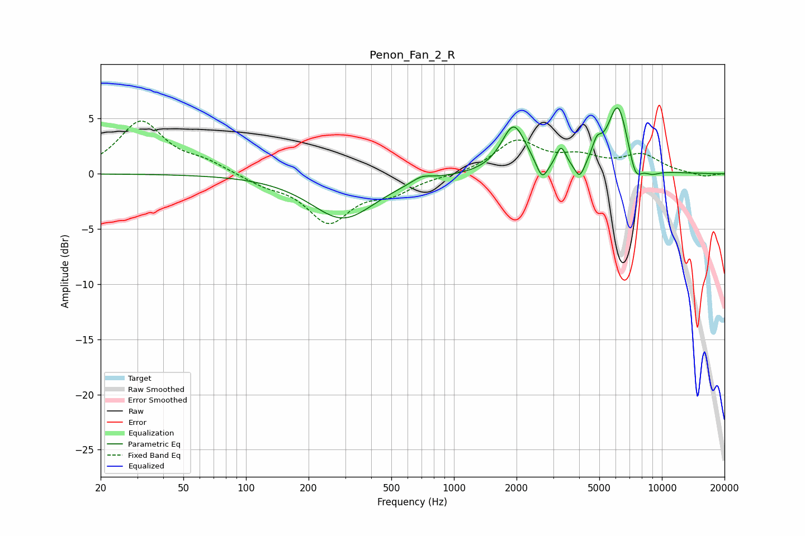

# Penon_Fan_2_R
See [usage instructions](https://github.com/jaakkopasanen/AutoEq#usage) for more options and info.

### Parametric EQs
Apply preamp of -6.1 dB when using parametric equalizer.

|   # | Type    |   Fc (Hz) |    Q |   Gain (dB) |
|-----|---------|-----------|------|-------------|
|   1 | Peaking |       293 | 0.92 |        -4   |
|   2 | Peaking |       701 | 2.98 |         0.5 |
|   3 | Peaking |      1939 | 2.43 |         4.4 |
|   4 | Peaking |      2655 | 5.26 |        -1.7 |
|   5 | Peaking |      3274 | 6    |         1.9 |
|   6 | Peaking |      4025 | 5.99 |        -1.5 |
|   7 | Peaking |      4863 | 6    |         1.5 |
|   8 | Peaking |      6143 | 2.73 |         6.3 |
|   9 | Peaking |      7448 | 4.34 |        -2.1 |
|  10 | Peaking |      8904 | 3.1  |        -0.5 |

### Fixed Band EQs
When using fixed band (also called graphic) equalizer, apply preamp of **-4.9 dB** (if available) and set gains manually with these parameters.

|   # | Type    |   Fc (Hz) |    Q |   Gain (dB) |
|-----|---------|-----------|------|-------------|
|   1 | Peaking |        31 | 1.41 |         4.7 |
|   2 | Peaking |        62 | 1.41 |         0.9 |
|   3 | Peaking |       125 | 1.41 |        -0.8 |
|   4 | Peaking |       250 | 1.41 |        -4.2 |
|   5 | Peaking |       500 | 1.41 |        -1.5 |
|   6 | Peaking |      1000 | 1.41 |        -0.2 |
|   7 | Peaking |      2000 | 1.41 |         2.9 |
|   8 | Peaking |      4000 | 1.41 |         1.3 |
|   9 | Peaking |      8000 | 1.41 |         1.6 |
|  10 | Peaking |     16000 | 1.41 |        -0.3 |

### Graphs

