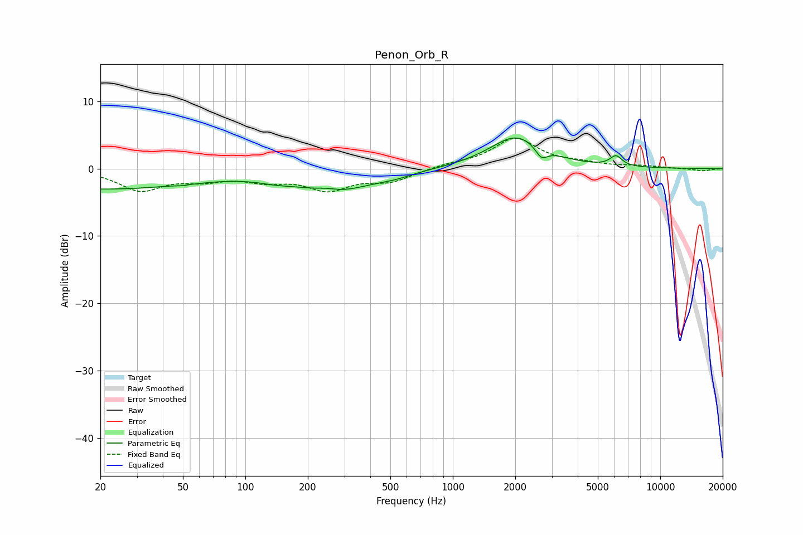

# Penon_Orb_R
See [usage instructions](https://github.com/jaakkopasanen/AutoEq#usage) for more options and info.

### Parametric EQs
Apply preamp of -4.7 dB when using parametric equalizer.

|   # | Type    |   Fc (Hz) |    Q |   Gain (dB) |
|-----|---------|-----------|------|-------------|
|   1 | Peaking |        20 | 0.29 |        -3   |
|   2 | Peaking |        52 | 5.72 |        -2.2 |
|   3 | Peaking |        53 | 6    |         2.1 |
|   4 | Peaking |       141 | 1.56 |        -0.6 |
|   5 | Peaking |       247 | 2.56 |         0.5 |
|   6 | Peaking |       271 | 0.83 |        -3.1 |
|   7 | Peaking |       525 | 1.54 |        -0.6 |
|   8 | Peaking |      2031 | 1.09 |         4.8 |
|   9 | Peaking |      2673 | 4.89 |        -1.7 |
|  10 | Peaking |      6117 | 4.83 |         1.5 |

### Fixed Band EQs
When using fixed band (also called graphic) equalizer, apply preamp of **-4.6 dB** (if available) and set gains manually with these parameters.

|   # | Type    |   Fc (Hz) |    Q |   Gain (dB) |
|-----|---------|-----------|------|-------------|
|   1 | Peaking |        31 | 1.41 |        -3.1 |
|   2 | Peaking |        62 | 1.41 |        -1.3 |
|   3 | Peaking |       125 | 1.41 |        -1.4 |
|   4 | Peaking |       250 | 1.41 |        -2.9 |
|   5 | Peaking |       500 | 1.41 |        -1.7 |
|   6 | Peaking |      1000 | 1.41 |         0.5 |
|   7 | Peaking |      2000 | 1.41 |         4.4 |
|   8 | Peaking |      4000 | 1.41 |         0.6 |
|   9 | Peaking |      8000 | 1.41 |         0.3 |
|  10 | Peaking |     16000 | 1.41 |        -0.3 |

### Graphs

