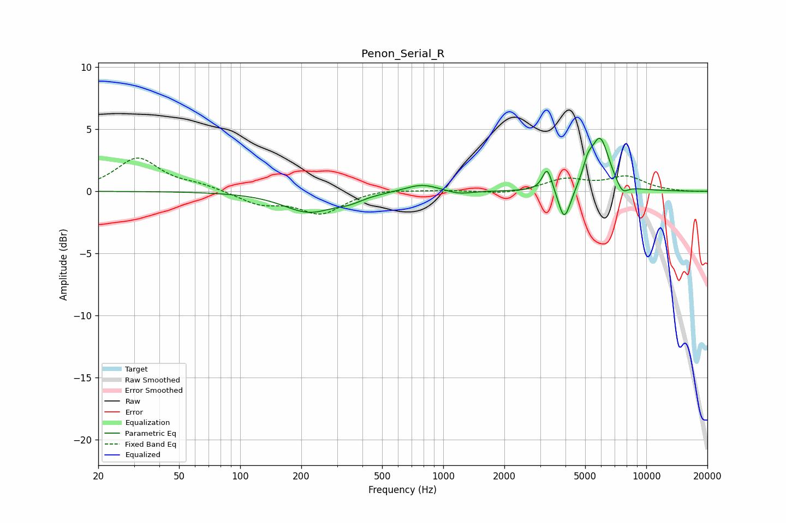

# Penon_Serial_R
See [usage instructions](https://github.com/jaakkopasanen/AutoEq#usage) for more options and info.

### Parametric EQs
Apply preamp of -4.4 dB when using parametric equalizer.

|   # | Type    |   Fc (Hz) |    Q |   Gain (dB) |
|-----|---------|-----------|------|-------------|
|   1 | Peaking |       218 | 1.12 |        -1.6 |
|   2 | Peaking |       346 | 2.26 |        -0.4 |
|   3 | Peaking |       784 | 1.69 |         0.7 |
|   4 | Peaking |      1196 | 2.3  |        -0.3 |
|   5 | Peaking |      3251 | 6    |         1.9 |
|   6 | Peaking |      3926 | 5.18 |        -2.2 |
|   7 | Peaking |      4154 | 4.04 |        -0.6 |
|   8 | Peaking |      5149 | 5.99 |         1.2 |
|   9 | Peaking |      5919 | 3.01 |         4.2 |
|  10 | Peaking |      7625 | 4.57 |        -0.9 |

### Fixed Band EQs
When using fixed band (also called graphic) equalizer, apply preamp of **-2.8 dB** (if available) and set gains manually with these parameters.

|   # | Type    |   Fc (Hz) |    Q |   Gain (dB) |
|-----|---------|-----------|------|-------------|
|   1 | Peaking |        31 | 1.41 |         2.6 |
|   2 | Peaking |        62 | 1.41 |         0.4 |
|   3 | Peaking |       125 | 1.41 |        -1   |
|   4 | Peaking |       250 | 1.41 |        -1.7 |
|   5 | Peaking |       500 | 1.41 |         0.2 |
|   6 | Peaking |      1000 | 1.41 |         0.1 |
|   7 | Peaking |      2000 | 1.41 |        -0.3 |
|   8 | Peaking |      4000 | 1.41 |         0.9 |
|   9 | Peaking |      8000 | 1.41 |         1.1 |
|  10 | Peaking |     16000 | 1.41 |        -0   |

### Graphs

