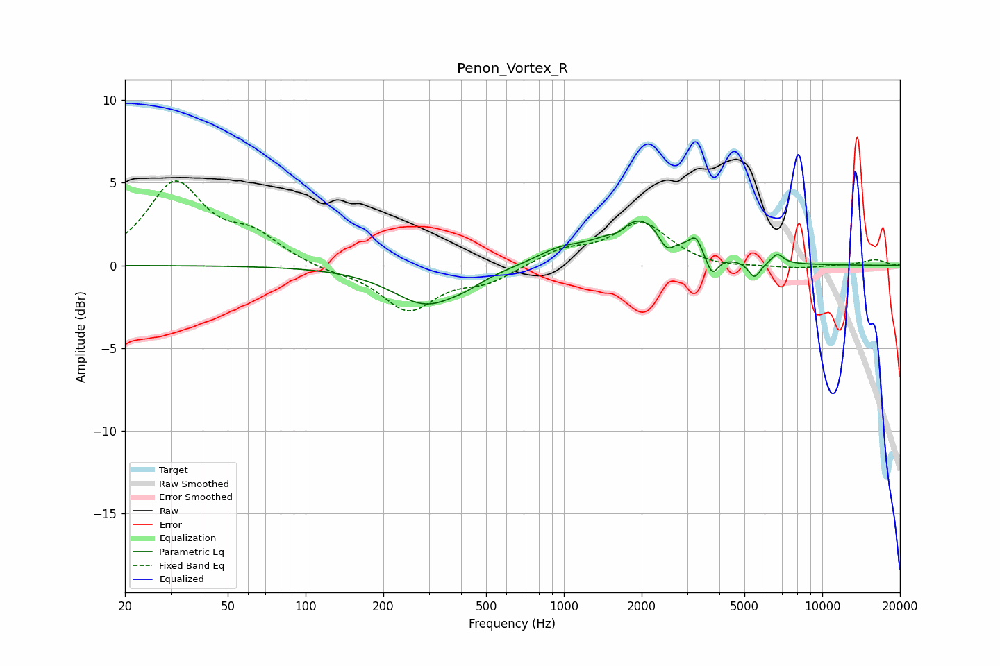

# Penon_Vortex_R
See [usage instructions](https://github.com/jaakkopasanen/AutoEq#usage) for more options and info.

### Parametric EQs
Apply preamp of -2.8 dB when using parametric equalizer.

|   # | Type    |   Fc (Hz) |    Q |   Gain (dB) |
|-----|---------|-----------|------|-------------|
|   1 | Peaking |       293 | 1.07 |        -2.3 |
|   2 | Peaking |       420 | 2.26 |        -0.3 |
|   3 | Peaking |       966 | 1.52 |         0.7 |
|   4 | Peaking |      1622 | 4.78 |        -0.4 |
|   5 | Peaking |      1990 | 1.18 |         2.9 |
|   6 | Peaking |      2495 | 4.42 |        -1.2 |
|   7 | Peaking |      3241 | 6    |         0.9 |
|   8 | Peaking |      3745 | 6    |        -1.3 |
|   9 | Peaking |      5467 | 6    |        -1   |
|  10 | Peaking |      6705 | 6    |         0.6 |

### Fixed Band EQs
When using fixed band (also called graphic) equalizer, apply preamp of **-5.2 dB** (if available) and set gains manually with these parameters.

|   # | Type    |   Fc (Hz) |    Q |   Gain (dB) |
|-----|---------|-----------|------|-------------|
|   1 | Peaking |        31 | 1.41 |         4.8 |
|   2 | Peaking |        62 | 1.41 |         1.6 |
|   3 | Peaking |       125 | 1.41 |        -0.3 |
|   4 | Peaking |       250 | 1.41 |        -2.7 |
|   5 | Peaking |       500 | 1.41 |        -0.9 |
|   6 | Peaking |      1000 | 1.41 |         0.9 |
|   7 | Peaking |      2000 | 1.41 |         2.5 |
|   8 | Peaking |      4000 | 1.41 |        -0.2 |
|   9 | Peaking |      8000 | 1.41 |        -0.2 |
|  10 | Peaking |     16000 | 1.41 |         0.3 |

### Graphs

