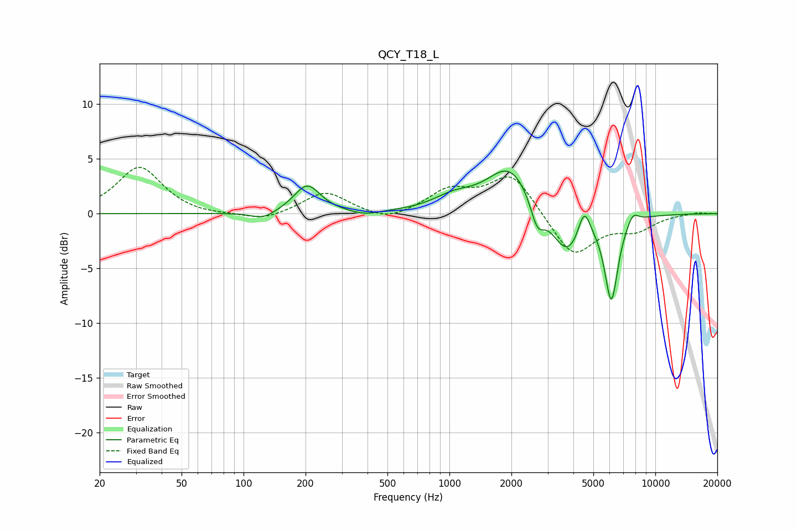

# QCY_T18_L
See [usage instructions](https://github.com/jaakkopasanen/AutoEq#usage) for more options and info.

### Parametric EQs
Apply preamp of -4.0 dB when using parametric equalizer.

|   # | Type    |   Fc (Hz) |    Q |   Gain (dB) |
|-----|---------|-----------|------|-------------|
|   1 | Peaking |       124 | 2.45 |        -0.7 |
|   2 | Peaking |       204 | 2.23 |         2.6 |
|   3 | Peaking |       389 | 2.16 |        -0.4 |
|   4 | Peaking |      1049 | 1.4  |         1.2 |
|   5 | Peaking |      1973 | 1.27 |         4.4 |
|   6 | Peaking |      2672 | 4.27 |        -2.4 |
|   7 | Peaking |      3735 | 1.82 |        -4.1 |
|   8 | Peaking |      4513 | 4.69 |         2.7 |
|   9 | Peaking |      6114 | 4.25 |        -7.7 |
|  10 | Peaking |      7770 | 4.81 |         1.1 |

### Fixed Band EQs
When using fixed band (also called graphic) equalizer, apply preamp of **-4.3 dB** (if available) and set gains manually with these parameters.

|   # | Type    |   Fc (Hz) |    Q |   Gain (dB) |
|-----|---------|-----------|------|-------------|
|   1 | Peaking |        31 | 1.41 |         4.3 |
|   2 | Peaking |        62 | 1.41 |        -0.2 |
|   3 | Peaking |       125 | 1.41 |        -0.7 |
|   4 | Peaking |       250 | 1.41 |         2   |
|   5 | Peaking |       500 | 1.41 |        -0.8 |
|   6 | Peaking |      1000 | 1.41 |         2   |
|   7 | Peaking |      2000 | 1.41 |         3.7 |
|   8 | Peaking |      4000 | 1.41 |        -4   |
|   9 | Peaking |      8000 | 1.41 |        -1.3 |
|  10 | Peaking |     16000 | 1.41 |         0.2 |

### Graphs

