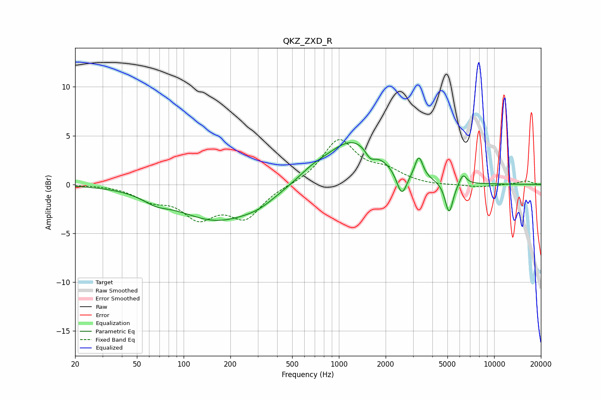

# QKZ_ZXD_R
See [usage instructions](https://github.com/jaakkopasanen/AutoEq#usage) for more options and info.

### Parametric EQs
Apply preamp of -4.4 dB when using parametric equalizer.

|   # | Type    |   Fc (Hz) |    Q |   Gain (dB) |
|-----|---------|-----------|------|-------------|
|   1 | Peaking |        66 | 1.74 |        -0.7 |
|   2 | Peaking |       164 | 0.55 |        -3.6 |
|   3 | Peaking |       307 | 1.28 |        -0.7 |
|   4 | Peaking |       669 | 1.62 |         0.6 |
|   5 | Peaking |      1240 | 0.79 |         4.6 |
|   6 | Peaking |      1595 | 4.3  |        -1.1 |
|   7 | Peaking |      2541 | 4.24 |        -2.6 |
|   8 | Peaking |      3273 | 5.61 |         2.2 |
|   9 | Peaking |      5127 | 5.43 |        -3.3 |
|  10 | Peaking |      6298 | 6    |         1.1 |

### Fixed Band EQs
When using fixed band (also called graphic) equalizer, apply preamp of **-4.7 dB** (if available) and set gains manually with these parameters.

|   # | Type    |   Fc (Hz) |    Q |   Gain (dB) |
|-----|---------|-----------|------|-------------|
|   1 | Peaking |        31 | 1.41 |         0   |
|   2 | Peaking |        62 | 1.41 |        -1.3 |
|   3 | Peaking |       125 | 1.41 |        -3   |
|   4 | Peaking |       250 | 1.41 |        -3.2 |
|   5 | Peaking |       500 | 1.41 |        -0.1 |
|   6 | Peaking |      1000 | 1.41 |         4.5 |
|   7 | Peaking |      2000 | 1.41 |         1.2 |
|   8 | Peaking |      4000 | 1.41 |        -0.1 |
|   9 | Peaking |      8000 | 1.41 |        -0.3 |
|  10 | Peaking |     16000 | 1.41 |         0.4 |

### Graphs

