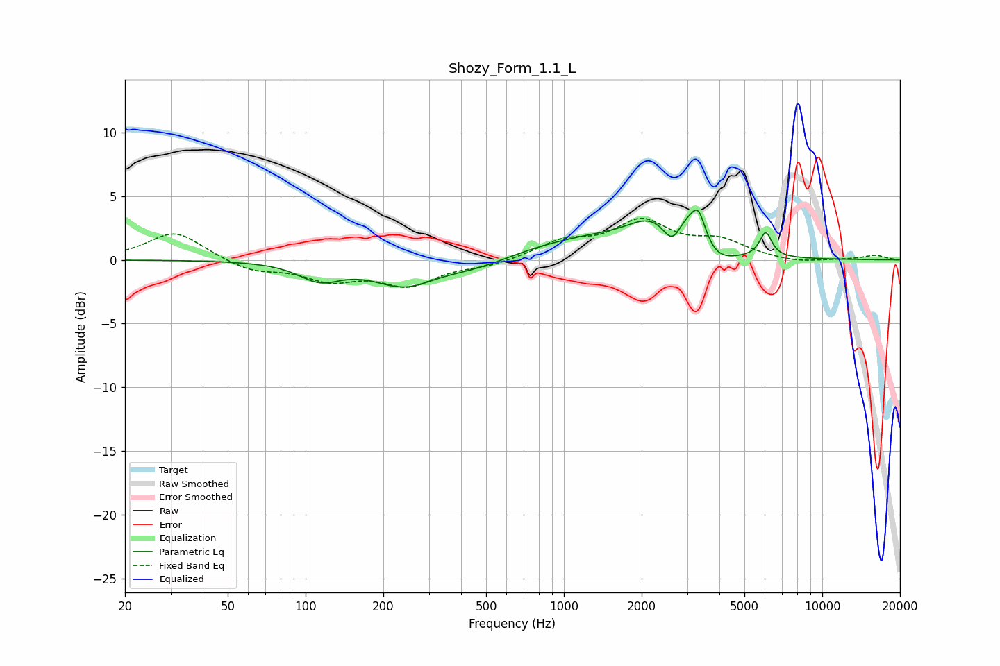

# Shozy_Form_1.1_L
See [usage instructions](https://github.com/jaakkopasanen/AutoEq#usage) for more options and info.

### Parametric EQs
Apply preamp of -4.0 dB when using parametric equalizer.

|   # | Type    |   Fc (Hz) |    Q |   Gain (dB) |
|-----|---------|-----------|------|-------------|
|   1 | Peaking |       114 | 1.75 |        -1.4 |
|   2 | Peaking |       241 | 1.19 |        -1.9 |
|   3 | Peaking |       458 | 1.06 |        -0.7 |
|   4 | Peaking |      1229 | 0.57 |         1.6 |
|   5 | Peaking |      2148 | 1.57 |         1.7 |
|   6 | Peaking |      2629 | 4    |        -1.9 |
|   7 | Peaking |      3180 | 1.85 |         3.9 |
|   8 | Peaking |      3324 | 5.99 |         1.5 |
|   9 | Peaking |      3722 | 1.83 |        -2.6 |
|  10 | Peaking |      6045 | 6    |         1.9 |

### Fixed Band EQs
When using fixed band (also called graphic) equalizer, apply preamp of **-3.4 dB** (if available) and set gains manually with these parameters.

|   # | Type    |   Fc (Hz) |    Q |   Gain (dB) |
|-----|---------|-----------|------|-------------|
|   1 | Peaking |        31 | 1.41 |         2.2 |
|   2 | Peaking |        62 | 1.41 |        -0.9 |
|   3 | Peaking |       125 | 1.41 |        -1.4 |
|   4 | Peaking |       250 | 1.41 |        -1.9 |
|   5 | Peaking |       500 | 1.41 |        -0.4 |
|   6 | Peaking |      1000 | 1.41 |         1.3 |
|   7 | Peaking |      2000 | 1.41 |         2.8 |
|   8 | Peaking |      4000 | 1.41 |         1.3 |
|   9 | Peaking |      8000 | 1.41 |        -0.3 |
|  10 | Peaking |     16000 | 1.41 |         0.4 |

### Graphs

