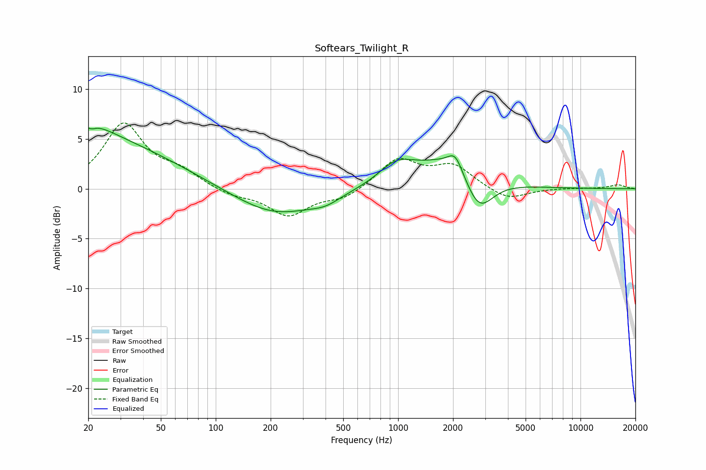

# Softears_Twilight_R
See [usage instructions](https://github.com/jaakkopasanen/AutoEq#usage) for more options and info.

### Parametric EQs
Apply preamp of -6.2 dB when using parametric equalizer.

|   # | Type    |   Fc (Hz) |    Q |   Gain (dB) |
|-----|---------|-----------|------|-------------|
|   1 | Peaking |        20 | 1.15 |         1.6 |
|   2 | Peaking |        20 | 0.31 |         4.8 |
|   3 | Peaking |        21 | 5.9  |         3.2 |
|   4 | Peaking |        21 | 5.97 |        -3.6 |
|   5 | Peaking |       212 | 0.62 |        -2.7 |
|   6 | Peaking |       399 | 1.78 |        -0.7 |
|   7 | Peaking |       976 | 1.45 |         2   |
|   8 | Peaking |      1925 | 0.78 |         3.1 |
|   9 | Peaking |      2060 | 3.6  |         1.7 |
|  10 | Peaking |      2765 | 1.76 |        -4   |

### Fixed Band EQs
When using fixed band (also called graphic) equalizer, apply preamp of **-6.7 dB** (if available) and set gains manually with these parameters.

|   # | Type    |   Fc (Hz) |    Q |   Gain (dB) |
|-----|---------|-----------|------|-------------|
|   1 | Peaking |        31 | 1.41 |         6.4 |
|   2 | Peaking |        62 | 1.41 |         1.5 |
|   3 | Peaking |       125 | 1.41 |        -0.7 |
|   4 | Peaking |       250 | 1.41 |        -2.6 |
|   5 | Peaking |       500 | 1.41 |        -1   |
|   6 | Peaking |      1000 | 1.41 |         2.9 |
|   7 | Peaking |      2000 | 1.41 |         2.2 |
|   8 | Peaking |      4000 | 1.41 |        -1.2 |
|   9 | Peaking |      8000 | 1.41 |         0.1 |
|  10 | Peaking |     16000 | 1.41 |         0.4 |

### Graphs

