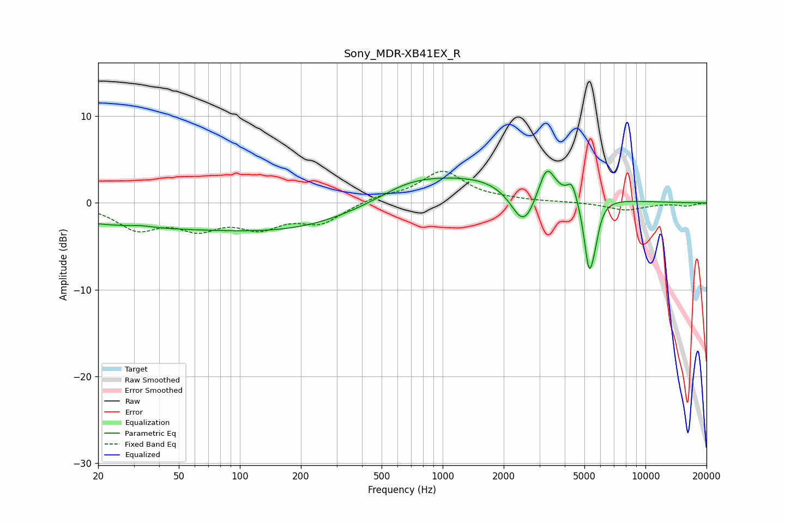

# Sony_MDR-XB41EX_R
See [usage instructions](https://github.com/jaakkopasanen/AutoEq#usage) for more options and info.

### Parametric EQs
Apply preamp of -3.8 dB when using parametric equalizer.

|   # | Type    |   Fc (Hz) |    Q |   Gain (dB) |
|-----|---------|-----------|------|-------------|
|   1 | Peaking |        33 | 2.56 |         0.2 |
|   2 | Peaking |        55 | 0.18 |        -2.9 |
|   3 | Peaking |       290 | 0.4  |        -1.4 |
|   4 | Peaking |       679 | 1.06 |         0.9 |
|   5 | Peaking |      1272 | 0.35 |         3.4 |
|   6 | Peaking |      2512 | 2.21 |        -4.9 |
|   7 | Peaking |      3256 | 3.53 |         3.7 |
|   8 | Peaking |      4345 | 6    |         1.9 |
|   9 | Peaking |      5267 | 5.65 |        -7.5 |
|  10 | Peaking |      5628 | 6    |        -2.3 |

### Fixed Band EQs
When using fixed band (also called graphic) equalizer, apply preamp of **-3.7 dB** (if available) and set gains manually with these parameters.

|   # | Type    |   Fc (Hz) |    Q |   Gain (dB) |
|-----|---------|-----------|------|-------------|
|   1 | Peaking |        31 | 1.41 |        -2.8 |
|   2 | Peaking |        62 | 1.41 |        -2.5 |
|   3 | Peaking |       125 | 1.41 |        -2.4 |
|   4 | Peaking |       250 | 1.41 |        -2.2 |
|   5 | Peaking |       500 | 1.41 |         0.7 |
|   6 | Peaking |      1000 | 1.41 |         3.6 |
|   7 | Peaking |      2000 | 1.41 |         0.3 |
|   8 | Peaking |      4000 | 1.41 |         0.1 |
|   9 | Peaking |      8000 | 1.41 |        -0.8 |
|  10 | Peaking |     16000 | 1.41 |        -0.3 |

### Graphs

