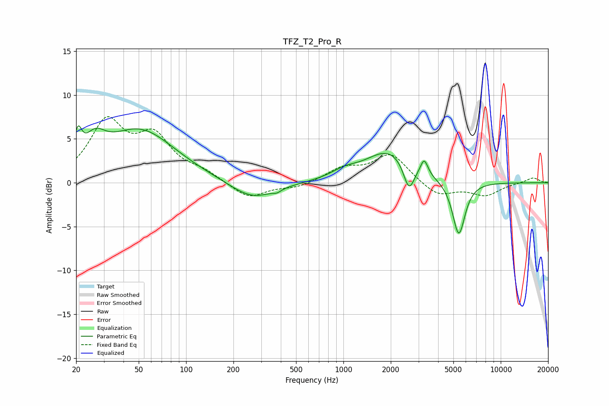

# TFZ_T2_Pro_R
See [usage instructions](https://github.com/jaakkopasanen/AutoEq#usage) for more options and info.

### Parametric EQs
Apply preamp of -6.6 dB when using parametric equalizer.

|   # | Type    |   Fc (Hz) |    Q |   Gain (dB) |
|-----|---------|-----------|------|-------------|
|   1 | Peaking |        21 | 5.98 |         3   |
|   2 | Peaking |        26 | 2.17 |         2.6 |
|   3 | Peaking |        51 | 0.63 |         5.9 |
|   4 | Peaking |       264 | 1    |        -2.1 |
|   5 | Peaking |       378 | 5.89 |        -0.3 |
|   6 | Peaking |      1013 | 1.66 |         0.8 |
|   7 | Peaking |      1951 | 0.96 |         3.6 |
|   8 | Peaking |      2609 | 4.14 |        -3.1 |
|   9 | Peaking |      3260 | 5.98 |         1.8 |
|  10 | Peaking |      5412 | 3.47 |        -6.2 |

### Fixed Band EQs
When using fixed band (also called graphic) equalizer, apply preamp of **-7.6 dB** (if available) and set gains manually with these parameters.

|   # | Type    |   Fc (Hz) |    Q |   Gain (dB) |
|-----|---------|-----------|------|-------------|
|   1 | Peaking |        31 | 1.41 |         6.6 |
|   2 | Peaking |        62 | 1.41 |         4.7 |
|   3 | Peaking |       125 | 1.41 |         1   |
|   4 | Peaking |       250 | 1.41 |        -1.8 |
|   5 | Peaking |       500 | 1.41 |        -0.6 |
|   6 | Peaking |      1000 | 1.41 |         1.5 |
|   7 | Peaking |      2000 | 1.41 |         3.2 |
|   8 | Peaking |      4000 | 1.41 |        -1.6 |
|   9 | Peaking |      8000 | 1.41 |        -1.4 |
|  10 | Peaking |     16000 | 1.41 |         0.6 |

### Graphs

