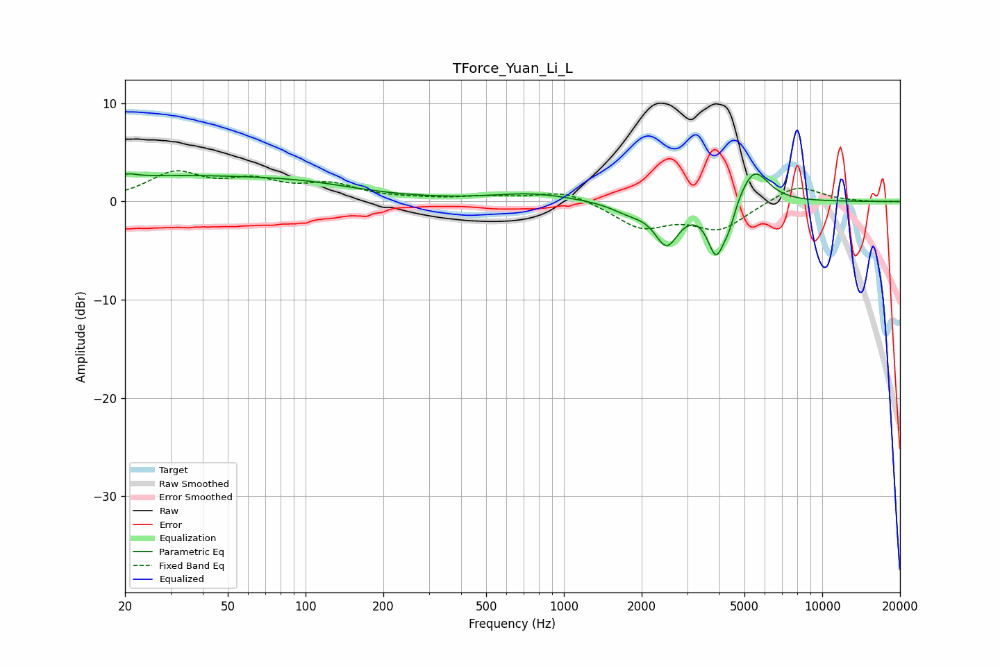

# TForce_Yuan_Li_L
See [usage instructions](https://github.com/jaakkopasanen/AutoEq#usage) for more options and info.

### Parametric EQs
Apply preamp of -2.9 dB when using parametric equalizer.

|   # | Type    |   Fc (Hz) |    Q |   Gain (dB) |
|-----|---------|-----------|------|-------------|
|   1 | Peaking |        21 | 5.94 |         2.4 |
|   2 | Peaking |        21 | 6    |        -2.2 |
|   3 | Peaking |        28 | 0.23 |         2.6 |
|   4 | Peaking |       105 | 0.72 |         0.5 |
|   5 | Peaking |       753 | 0.93 |         0.8 |
|   6 | Peaking |      1786 | 2.04 |        -0.9 |
|   7 | Peaking |      2497 | 3.02 |        -4.1 |
|   8 | Peaking |      3889 | 4.09 |        -5.3 |
|   9 | Peaking |      4362 | 6    |        -1.5 |
|  10 | Peaking |      5444 | 2.49 |         3.6 |

### Fixed Band EQs
When using fixed band (also called graphic) equalizer, apply preamp of **-3.2 dB** (if available) and set gains manually with these parameters.

|   # | Type    |   Fc (Hz) |    Q |   Gain (dB) |
|-----|---------|-----------|------|-------------|
|   1 | Peaking |        31 | 1.41 |         2.7 |
|   2 | Peaking |        62 | 1.41 |         1.8 |
|   3 | Peaking |       125 | 1.41 |         1.5 |
|   4 | Peaking |       250 | 1.41 |         0.2 |
|   5 | Peaking |       500 | 1.41 |         0.4 |
|   6 | Peaking |      1000 | 1.41 |         1.1 |
|   7 | Peaking |      2000 | 1.41 |        -2.5 |
|   8 | Peaking |      4000 | 1.41 |        -2.7 |
|   9 | Peaking |      8000 | 1.41 |         1.8 |
|  10 | Peaking |     16000 | 1.41 |        -0   |

### Graphs

