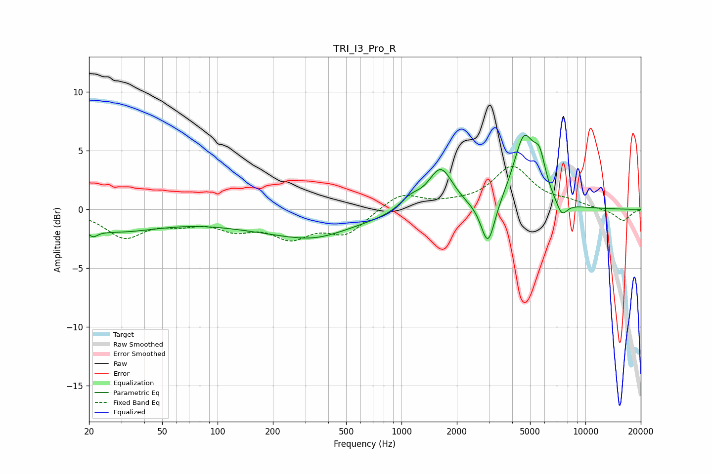

# TRI_I3_Pro_R
See [usage instructions](https://github.com/jaakkopasanen/AutoEq#usage) for more options and info.

### Parametric EQs
Apply preamp of -6.4 dB when using parametric equalizer.

|   # | Type    |   Fc (Hz) |    Q |   Gain (dB) |
|-----|---------|-----------|------|-------------|
|   1 | Peaking |        21 | 5.86 |        -0.5 |
|   2 | Peaking |        26 | 0.49 |        -1.8 |
|   3 | Peaking |       264 | 0.38 |        -1.8 |
|   4 | Peaking |       338 | 0.93 |        -0.7 |
|   5 | Peaking |      1118 | 2.4  |         1   |
|   6 | Peaking |      1634 | 2.15 |         3.5 |
|   7 | Peaking |      2953 | 3.73 |        -3.9 |
|   8 | Peaking |      4633 | 2.36 |         5.9 |
|   9 | Peaking |      5638 | 4.25 |         2.6 |
|  10 | Peaking |      7437 | 4.36 |        -1.3 |

### Fixed Band EQs
When using fixed band (also called graphic) equalizer, apply preamp of **-3.8 dB** (if available) and set gains manually with these parameters.

|   # | Type    |   Fc (Hz) |    Q |   Gain (dB) |
|-----|---------|-----------|------|-------------|
|   1 | Peaking |        31 | 1.41 |        -2.2 |
|   2 | Peaking |        62 | 1.41 |        -0.9 |
|   3 | Peaking |       125 | 1.41 |        -1.4 |
|   4 | Peaking |       250 | 1.41 |        -2.1 |
|   5 | Peaking |       500 | 1.41 |        -2   |
|   6 | Peaking |      1000 | 1.41 |         1.4 |
|   7 | Peaking |      2000 | 1.41 |         0.3 |
|   8 | Peaking |      4000 | 1.41 |         3.5 |
|   9 | Peaking |      8000 | 1.41 |         0.5 |
|  10 | Peaking |     16000 | 1.41 |        -1   |

### Graphs

