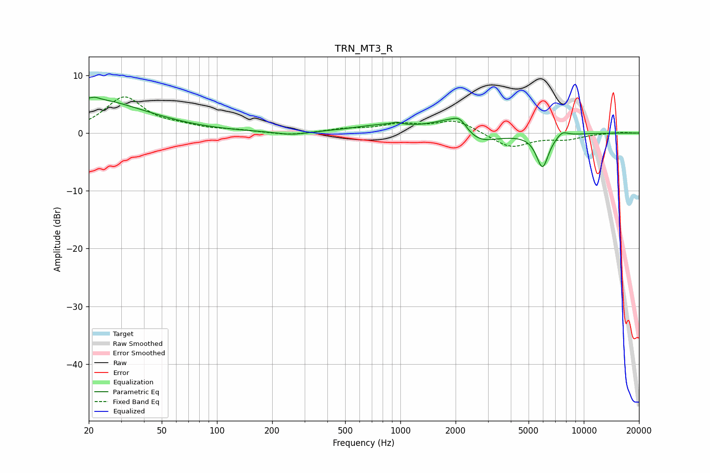

# TRN_MT3_R
See [usage instructions](https://github.com/jaakkopasanen/AutoEq#usage) for more options and info.

### Parametric EQs
Apply preamp of -6.3 dB when using parametric equalizer.

|   # | Type    |   Fc (Hz) |    Q |   Gain (dB) |
|-----|---------|-----------|------|-------------|
|   1 | Peaking |        20 | 0.47 |         5.9 |
|   2 | Peaking |        22 | 5.96 |         0.3 |
|   3 | Peaking |       254 | 1.8  |        -0.6 |
|   4 | Peaking |       793 | 0.9  |         1.2 |
|   5 | Peaking |       952 | 5.92 |         0.4 |
|   6 | Peaking |      1904 | 1.31 |         2.8 |
|   7 | Peaking |      2111 | 3.56 |         1.8 |
|   8 | Peaking |      2573 | 1.33 |        -2.8 |
|   9 | Peaking |      5955 | 4.06 |        -5.8 |
|  10 | Peaking |      7628 | 4.47 |         0.9 |

### Fixed Band EQs
When using fixed band (also called graphic) equalizer, apply preamp of **-6.3 dB** (if available) and set gains manually with these parameters.

|   # | Type    |   Fc (Hz) |    Q |   Gain (dB) |
|-----|---------|-----------|------|-------------|
|   1 | Peaking |        31 | 1.41 |         6.1 |
|   2 | Peaking |        62 | 1.41 |         0.8 |
|   3 | Peaking |       125 | 1.41 |         0.4 |
|   4 | Peaking |       250 | 1.41 |        -0.5 |
|   5 | Peaking |       500 | 1.41 |         0.6 |
|   6 | Peaking |      1000 | 1.41 |         1.3 |
|   7 | Peaking |      2000 | 1.41 |         2.2 |
|   8 | Peaking |      4000 | 1.41 |        -2.6 |
|   9 | Peaking |      8000 | 1.41 |        -0.9 |
|  10 | Peaking |     16000 | 1.41 |         0.2 |

### Graphs

