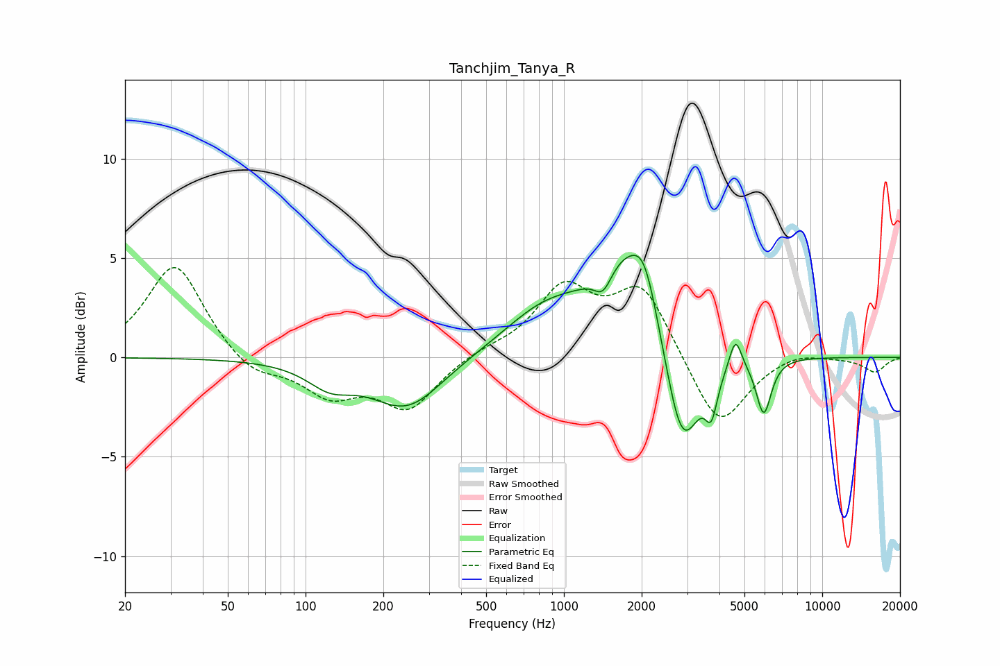

# Tanchjim_Tanya_R
See [usage instructions](https://github.com/jaakkopasanen/AutoEq#usage) for more options and info.

### Parametric EQs
Apply preamp of -5.2 dB when using parametric equalizer.

|   # | Type    |   Fc (Hz) |    Q |   Gain (dB) |
|-----|---------|-----------|------|-------------|
|   1 | Peaking |       124 | 1.62 |        -1.1 |
|   2 | Peaking |       247 | 1.01 |        -2.6 |
|   3 | Peaking |       837 | 0.88 |         2   |
|   4 | Peaking |      1419 | 4.09 |        -1.2 |
|   5 | Peaking |      1822 | 1.05 |         5.2 |
|   6 | Peaking |      2053 | 3.08 |         1.7 |
|   7 | Peaking |      2861 | 1.96 |        -6.4 |
|   8 | Peaking |      3723 | 6    |        -1.9 |
|   9 | Peaking |      4615 | 6    |         1.6 |
|  10 | Peaking |      5938 | 4.72 |        -2.8 |

### Fixed Band EQs
When using fixed band (also called graphic) equalizer, apply preamp of **-4.6 dB** (if available) and set gains manually with these parameters.

|   # | Type    |   Fc (Hz) |    Q |   Gain (dB) |
|-----|---------|-----------|------|-------------|
|   1 | Peaking |        31 | 1.41 |         4.8 |
|   2 | Peaking |        62 | 1.41 |        -1   |
|   3 | Peaking |       125 | 1.41 |        -1.8 |
|   4 | Peaking |       250 | 1.41 |        -2.5 |
|   5 | Peaking |       500 | 1.41 |         0.3 |
|   6 | Peaking |      1000 | 1.41 |         3.3 |
|   7 | Peaking |      2000 | 1.41 |         3.5 |
|   8 | Peaking |      4000 | 1.41 |        -3.7 |
|   9 | Peaking |      8000 | 1.41 |         0.4 |
|  10 | Peaking |     16000 | 1.41 |        -0.7 |

### Graphs

