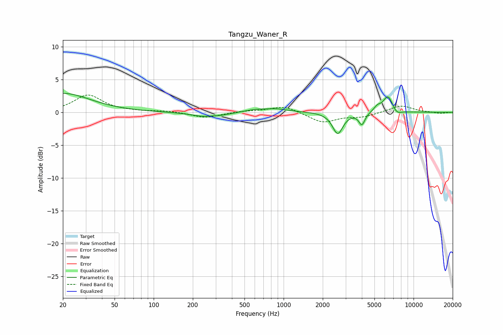

# Tangzu_Waner_R
See [usage instructions](https://github.com/jaakkopasanen/AutoEq#usage) for more options and info.

### Parametric EQs
Apply preamp of -3.0 dB when using parametric equalizer.

|   # | Type    |   Fc (Hz) |    Q |   Gain (dB) |
|-----|---------|-----------|------|-------------|
|   1 | Peaking |        20 | 0.68 |         2.9 |
|   2 | Peaking |       272 | 1.39 |        -1.2 |
|   3 | Peaking |       277 | 2.31 |         0.5 |
|   4 | Peaking |       731 | 2.15 |        -0.8 |
|   5 | Peaking |       736 | 1.4  |         1.4 |
|   6 | Peaking |      2607 | 3.55 |        -3.2 |
|   7 | Peaking |      4001 | 6    |        -1.8 |
|   8 | Peaking |      5265 | 5.18 |         0.7 |
|   9 | Peaking |      6351 | 3.71 |         2.6 |
|  10 | Peaking |      7414 | 4    |        -0.7 |

### Fixed Band EQs
When using fixed band (also called graphic) equalizer, apply preamp of **-2.7 dB** (if available) and set gains manually with these parameters.

|   # | Type    |   Fc (Hz) |    Q |   Gain (dB) |
|-----|---------|-----------|------|-------------|
|   1 | Peaking |        31 | 1.41 |         2.6 |
|   2 | Peaking |        62 | 1.41 |         0.1 |
|   3 | Peaking |       125 | 1.41 |         0.2 |
|   4 | Peaking |       250 | 1.41 |        -0.8 |
|   5 | Peaking |       500 | 1.41 |         0.2 |
|   6 | Peaking |      1000 | 1.41 |         1   |
|   7 | Peaking |      2000 | 1.41 |        -1.5 |
|   8 | Peaking |      4000 | 1.41 |        -0.6 |
|   9 | Peaking |      8000 | 1.41 |         1.1 |
|  10 | Peaking |     16000 | 1.41 |        -0.2 |

### Graphs

