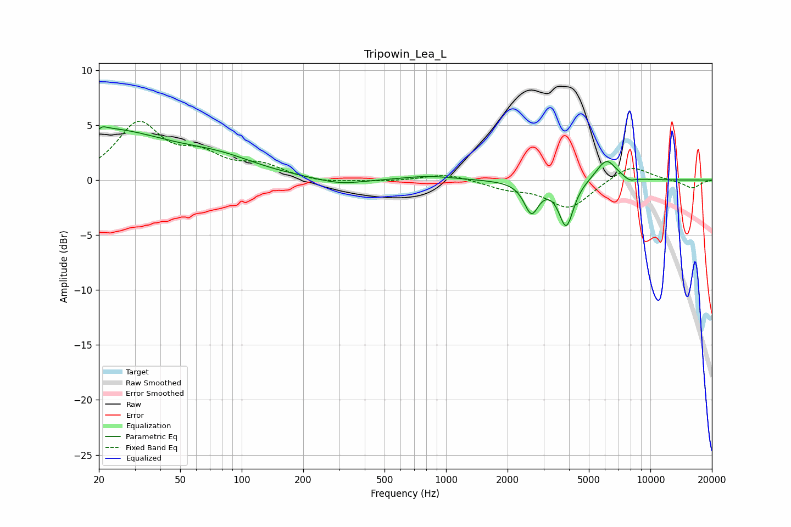

# Tripowin_Lea_L
See [usage instructions](https://github.com/jaakkopasanen/AutoEq#usage) for more options and info.

### Parametric EQs
Apply preamp of -4.9 dB when using parametric equalizer.

|   # | Type    |   Fc (Hz) |    Q |   Gain (dB) |
|-----|---------|-----------|------|-------------|
|   1 | Peaking |        20 | 0.41 |         4.5 |
|   2 | Peaking |        20 | 5.97 |        -3.1 |
|   3 | Peaking |        20 | 5.96 |         3.1 |
|   4 | Peaking |        80 | 0.76 |         1.2 |
|   5 | Peaking |       304 | 1.25 |        -0.5 |
|   6 | Peaking |       824 | 1.14 |         0.4 |
|   7 | Peaking |      2617 | 3.98 |        -2.8 |
|   8 | Peaking |      3873 | 3.93 |        -4.1 |
|   9 | Peaking |      6092 | 2.79 |         2   |
|  10 | Peaking |      7901 | 4.78 |        -0.4 |

### Fixed Band EQs
When using fixed band (also called graphic) equalizer, apply preamp of **-5.5 dB** (if available) and set gains manually with these parameters.

|   # | Type    |   Fc (Hz) |    Q |   Gain (dB) |
|-----|---------|-----------|------|-------------|
|   1 | Peaking |        31 | 1.41 |         5   |
|   2 | Peaking |        62 | 1.41 |         1.9 |
|   3 | Peaking |       125 | 1.41 |         1.2 |
|   4 | Peaking |       250 | 1.41 |        -0.3 |
|   5 | Peaking |       500 | 1.41 |        -0.1 |
|   6 | Peaking |      1000 | 1.41 |         0.6 |
|   7 | Peaking |      2000 | 1.41 |        -0.7 |
|   8 | Peaking |      4000 | 1.41 |        -2.6 |
|   9 | Peaking |      8000 | 1.41 |         1.5 |
|  10 | Peaking |     16000 | 1.41 |        -0.8 |

### Graphs

