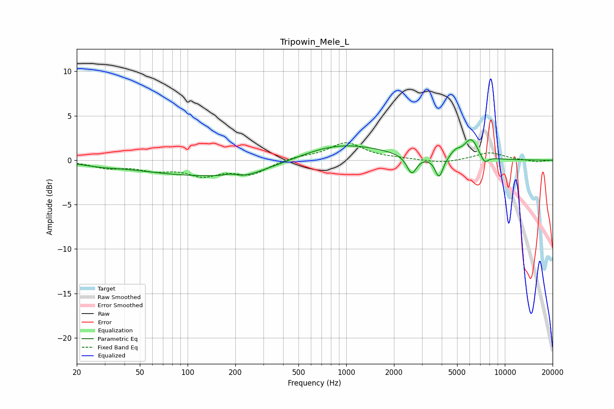

# Tripowin_Mele_L
See [usage instructions](https://github.com/jaakkopasanen/AutoEq#usage) for more options and info.

### Parametric EQs
Apply preamp of -2.4 dB when using parametric equalizer.

|   # | Type    |   Fc (Hz) |    Q |   Gain (dB) |
|-----|---------|-----------|------|-------------|
|   1 | Peaking |        28 | 1.47 |        -0.2 |
|   2 | Peaking |       160 | 0.27 |        -1.9 |
|   3 | Peaking |       188 | 3.56 |         0.3 |
|   4 | Peaking |       225 | 1.41 |        -0.5 |
|   5 | Peaking |       862 | 0.5  |         2.2 |
|   6 | Peaking |      2588 | 4.57 |        -2.1 |
|   7 | Peaking |      3850 | 5.66 |        -2.3 |
|   8 | Peaking |      4892 | 4.2  |         0.7 |
|   9 | Peaking |      6132 | 3.11 |         2.2 |
|  10 | Peaking |      7441 | 5.46 |        -0.9 |

### Fixed Band EQs
When using fixed band (also called graphic) equalizer, apply preamp of **-2.1 dB** (if available) and set gains manually with these parameters.

|   # | Type    |   Fc (Hz) |    Q |   Gain (dB) |
|-----|---------|-----------|------|-------------|
|   1 | Peaking |        31 | 1.41 |        -0.8 |
|   2 | Peaking |        62 | 1.41 |        -0.9 |
|   3 | Peaking |       125 | 1.41 |        -1.5 |
|   4 | Peaking |       250 | 1.41 |        -1.5 |
|   5 | Peaking |       500 | 1.41 |         0.4 |
|   6 | Peaking |      1000 | 1.41 |         1.9 |
|   7 | Peaking |      2000 | 1.41 |         0.1 |
|   8 | Peaking |      4000 | 1.41 |        -0.4 |
|   9 | Peaking |      8000 | 1.41 |         0.9 |
|  10 | Peaking |     16000 | 1.41 |        -0.2 |

### Graphs

