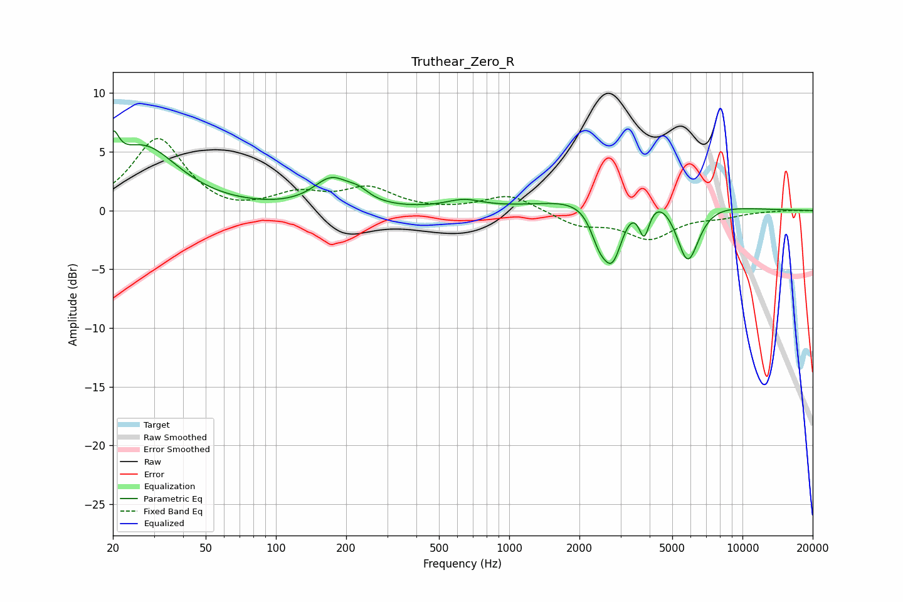

# Truthear_Zero_R
See [usage instructions](https://github.com/jaakkopasanen/AutoEq#usage) for more options and info.

### Parametric EQs
Apply preamp of -6.9 dB when using parametric equalizer.

|   # | Type    |   Fc (Hz) |    Q |   Gain (dB) |
|-----|---------|-----------|------|-------------|
|   1 | Peaking |        20 | 5.79 |         2.7 |
|   2 | Peaking |        27 | 0.94 |         5.3 |
|   3 | Peaking |       173 | 1.83 |         2.4 |
|   4 | Peaking |       225 | 2.95 |         0.8 |
|   5 | Peaking |       640 | 1.83 |         0.7 |
|   6 | Peaking |      2425 | 3.67 |        -2.3 |
|   7 | Peaking |      2777 | 2.93 |        -5.6 |
|   8 | Peaking |      3497 | 0.68 |         3.1 |
|   9 | Peaking |      3788 | 5.96 |        -3.1 |
|  10 | Peaking |      5816 | 2.72 |        -5.7 |

### Fixed Band EQs
When using fixed band (also called graphic) equalizer, apply preamp of **-6.2 dB** (if available) and set gains manually with these parameters.

|   # | Type    |   Fc (Hz) |    Q |   Gain (dB) |
|-----|---------|-----------|------|-------------|
|   1 | Peaking |        31 | 1.41 |         6.1 |
|   2 | Peaking |        62 | 1.41 |        -0.4 |
|   3 | Peaking |       125 | 1.41 |         1.3 |
|   4 | Peaking |       250 | 1.41 |         1.8 |
|   5 | Peaking |       500 | 1.41 |        -0   |
|   6 | Peaking |      1000 | 1.41 |         1.4 |
|   7 | Peaking |      2000 | 1.41 |        -1.2 |
|   8 | Peaking |      4000 | 1.41 |        -2.3 |
|   9 | Peaking |      8000 | 1.41 |        -0.4 |
|  10 | Peaking |     16000 | 1.41 |         0   |

### Graphs

