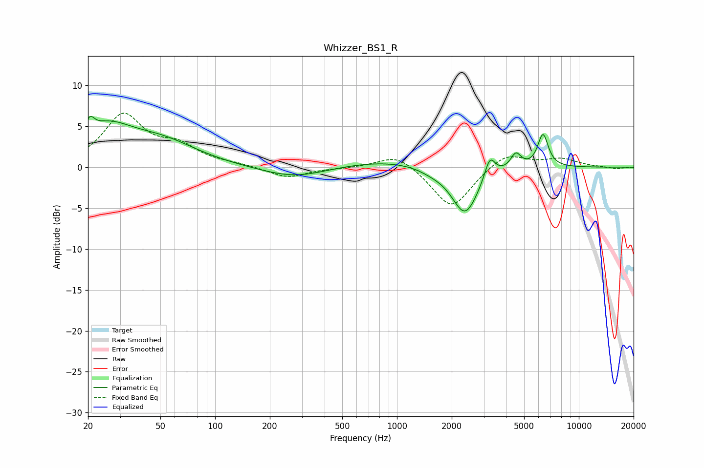

# Whizzer_BS1_R
See [usage instructions](https://github.com/jaakkopasanen/AutoEq#usage) for more options and info.

### Parametric EQs
Apply preamp of -6.3 dB when using parametric equalizer.

|   # | Type    |   Fc (Hz) |    Q |   Gain (dB) |
|-----|---------|-----------|------|-------------|
|   1 | Peaking |        20 | 5.57 |         1.9 |
|   2 | Peaking |        25 | 1.03 |         4   |
|   3 | Peaking |        50 | 0.7  |         2.8 |
|   4 | Peaking |       275 | 0.77 |        -1.5 |
|   5 | Peaking |       913 | 0.46 |         1   |
|   6 | Peaking |      1552 | 1.87 |        -0.5 |
|   7 | Peaking |      2366 | 1.91 |        -6   |
|   8 | Peaking |      3242 | 4.89 |         2.7 |
|   9 | Peaking |      4506 | 4.88 |         1.9 |
|  10 | Peaking |      6351 | 4.75 |         4   |

### Fixed Band EQs
When using fixed band (also called graphic) equalizer, apply preamp of **-6.7 dB** (if available) and set gains manually with these parameters.

|   # | Type    |   Fc (Hz) |    Q |   Gain (dB) |
|-----|---------|-----------|------|-------------|
|   1 | Peaking |        31 | 1.41 |         6.2 |
|   2 | Peaking |        62 | 1.41 |         2.2 |
|   3 | Peaking |       125 | 1.41 |         0.3 |
|   4 | Peaking |       250 | 1.41 |        -1.3 |
|   5 | Peaking |       500 | 1.41 |        -0.1 |
|   6 | Peaking |      1000 | 1.41 |         1.8 |
|   7 | Peaking |      2000 | 1.41 |        -5.2 |
|   8 | Peaking |      4000 | 1.41 |         1.9 |
|   9 | Peaking |      8000 | 1.41 |         1   |
|  10 | Peaking |     16000 | 1.41 |        -0.2 |

### Graphs

