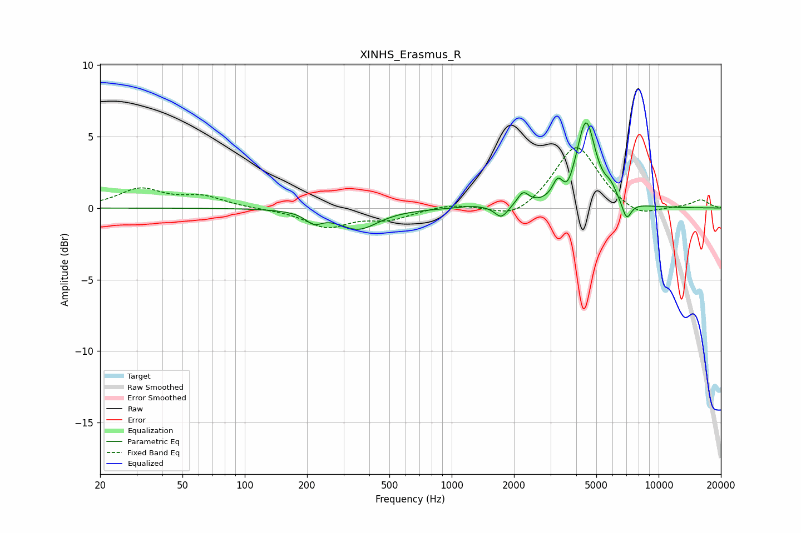

# XINHS_Erasmus_R
See [usage instructions](https://github.com/jaakkopasanen/AutoEq#usage) for more options and info.

### Parametric EQs
Apply preamp of -6.1 dB when using parametric equalizer.

|   # | Type    |   Fc (Hz) |    Q |   Gain (dB) |
|-----|---------|-----------|------|-------------|
|   1 | Peaking |       216 | 3.57 |        -0.7 |
|   2 | Peaking |       353 | 1.47 |        -1.4 |
|   3 | Peaking |      1266 | 1.95 |         0.2 |
|   4 | Peaking |      1739 | 4.58 |        -0.9 |
|   5 | Peaking |      2214 | 5.16 |         0.9 |
|   6 | Peaking |      3249 | 6    |         1.1 |
|   7 | Peaking |      3647 | 6    |        -0.6 |
|   8 | Peaking |      4459 | 3.1  |         5.9 |
|   9 | Peaking |      5875 | 4.57 |         0.8 |
|  10 | Peaking |      7003 | 5.97 |        -1.3 |

### Fixed Band EQs
When using fixed band (also called graphic) equalizer, apply preamp of **-4.3 dB** (if available) and set gains manually with these parameters.

|   # | Type    |   Fc (Hz) |    Q |   Gain (dB) |
|-----|---------|-----------|------|-------------|
|   1 | Peaking |        31 | 1.41 |         1.3 |
|   2 | Peaking |        62 | 1.41 |         0.7 |
|   3 | Peaking |       125 | 1.41 |        -0   |
|   4 | Peaking |       250 | 1.41 |        -1.3 |
|   5 | Peaking |       500 | 1.41 |        -0.7 |
|   6 | Peaking |      1000 | 1.41 |         0.3 |
|   7 | Peaking |      2000 | 1.41 |        -0.9 |
|   8 | Peaking |      4000 | 1.41 |         4.5 |
|   9 | Peaking |      8000 | 1.41 |        -0.8 |
|  10 | Peaking |     16000 | 1.41 |         0.6 |

### Graphs

