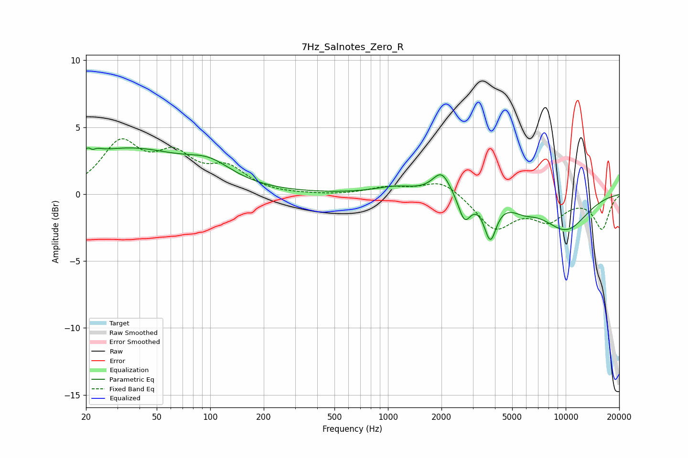

# 7Hz_Salnotes_Zero_R
See [usage instructions](https://github.com/jaakkopasanen/AutoEq#usage) for more options and info.

### Parametric EQs
Apply preamp of -3.5 dB when using parametric equalizer.

|   # | Type    |   Fc (Hz) |    Q |   Gain (dB) |
|-----|---------|-----------|------|-------------|
|   1 | Peaking |        21 | 4.96 |         3.1 |
|   2 | Peaking |        22 | 6    |        -2.5 |
|   3 | Peaking |        34 | 0.44 |         3.2 |
|   4 | Peaking |        99 | 1.1  |         1.3 |
|   5 | Peaking |      1111 | 1.23 |         0.5 |
|   6 | Peaking |      2005 | 2.79 |         1.7 |
|   7 | Peaking |      2696 | 4.14 |        -1.9 |
|   8 | Peaking |      3766 | 4.18 |        -2.9 |
|   9 | Peaking |      5813 | 2.11 |        -0.5 |
|  10 | Peaking |     10000 | 0.93 |        -2.6 |

### Fixed Band EQs
When using fixed band (also called graphic) equalizer, apply preamp of **-4.2 dB** (if available) and set gains manually with these parameters.

|   # | Type    |   Fc (Hz) |    Q |   Gain (dB) |
|-----|---------|-----------|------|-------------|
|   1 | Peaking |        31 | 1.41 |         3.6 |
|   2 | Peaking |        62 | 1.41 |         2.5 |
|   3 | Peaking |       125 | 1.41 |         1.7 |
|   4 | Peaking |       250 | 1.41 |        -0.1 |
|   5 | Peaking |       500 | 1.41 |        -0.1 |
|   6 | Peaking |      1000 | 1.41 |         0.5 |
|   7 | Peaking |      2000 | 1.41 |         1.1 |
|   8 | Peaking |      4000 | 1.41 |        -2.5 |
|   9 | Peaking |      8000 | 1.41 |        -1.7 |
|  10 | Peaking |     16000 | 1.41 |        -2.5 |

### Graphs

