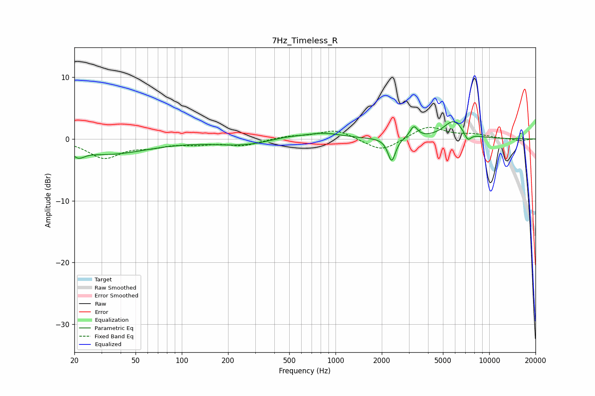

# 7Hz_Timeless_R
See [usage instructions](https://github.com/jaakkopasanen/AutoEq#usage) for more options and info.

### Parametric EQs
Apply preamp of -2.9 dB when using parametric equalizer.

|   # | Type    |   Fc (Hz) |    Q |   Gain (dB) |
|-----|---------|-----------|------|-------------|
|   1 | Peaking |        21 | 5.01 |        -2.4 |
|   2 | Peaking |        22 | 6    |         1.3 |
|   3 | Peaking |        32 | 0.52 |        -2.4 |
|   4 | Peaking |       254 | 0.75 |        -1   |
|   5 | Peaking |       476 | 1.2  |         0.5 |
|   6 | Peaking |       834 | 1.2  |         0.9 |
|   7 | Peaking |      2320 | 5.79 |        -3.8 |
|   8 | Peaking |      3231 | 5.71 |         1.9 |
|   9 | Peaking |      5856 | 2.11 |         2.9 |
|  10 | Peaking |      7242 | 6    |        -1.4 |

### Fixed Band EQs
When using fixed band (also called graphic) equalizer, apply preamp of **-2.0 dB** (if available) and set gains manually with these parameters.

|   # | Type    |   Fc (Hz) |    Q |   Gain (dB) |
|-----|---------|-----------|------|-------------|
|   1 | Peaking |        31 | 1.41 |        -3   |
|   2 | Peaking |        62 | 1.41 |        -1   |
|   3 | Peaking |       125 | 1.41 |        -0.7 |
|   4 | Peaking |       250 | 1.41 |        -1   |
|   5 | Peaking |       500 | 1.41 |         0.4 |
|   6 | Peaking |      1000 | 1.41 |         1.5 |
|   7 | Peaking |      2000 | 1.41 |        -2.1 |
|   8 | Peaking |      4000 | 1.41 |         2.1 |
|   9 | Peaking |      8000 | 1.41 |         0.6 |
|  10 | Peaking |     16000 | 1.41 |        -0.3 |

### Graphs

