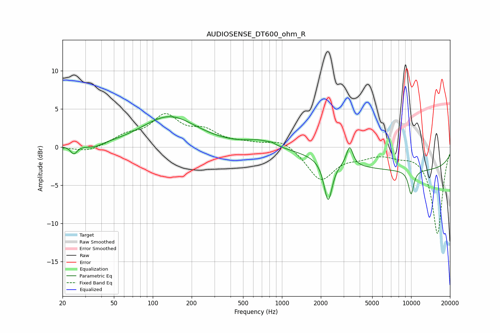

# AUDIOSENSE_DT600_ohm_R
See [usage instructions](https://github.com/jaakkopasanen/AutoEq#usage) for more options and info.

### Parametric EQs
Apply preamp of -4.1 dB when using parametric equalizer.

|   # | Type    |   Fc (Hz) |    Q |   Gain (dB) |
|-----|---------|-----------|------|-------------|
|   1 | Peaking |        25 | 5.77 |        -1.1 |
|   2 | Peaking |        35 | 2.29 |        -0.5 |
|   3 | Peaking |       134 | 0.68 |         4   |
|   4 | Peaking |       681 | 1.34 |         0.8 |
|   5 | Peaking |       836 | 5.88 |         0.2 |
|   6 | Peaking |      2207 | 3.59 |         0.3 |
|   7 | Peaking |      2276 | 4.44 |        -5.7 |
|   8 | Peaking |      3345 | 5.71 |         2.5 |
|   9 | Peaking |     10000 | 5.71 |        -3.1 |
|  10 | Peaking |     10000 | 0.18 |        -3   |

### Fixed Band EQs
When using fixed band (also called graphic) equalizer, apply preamp of **-4.5 dB** (if available) and set gains manually with these parameters.

|   # | Type    |   Fc (Hz) |    Q |   Gain (dB) |
|-----|---------|-----------|------|-------------|
|   1 | Peaking |        31 | 1.41 |        -0.7 |
|   2 | Peaking |        62 | 1.41 |         1.3 |
|   3 | Peaking |       125 | 1.41 |         3.8 |
|   4 | Peaking |       250 | 1.41 |         1.8 |
|   5 | Peaking |       500 | 1.41 |         0.4 |
|   6 | Peaking |      1000 | 1.41 |         1.1 |
|   7 | Peaking |      2000 | 1.41 |        -4.3 |
|   8 | Peaking |      4000 | 1.41 |        -0.9 |
|   9 | Peaking |      8000 | 1.41 |        -0.7 |
|  10 | Peaking |     16000 | 1.41 |       -11.3 |

### Graphs

