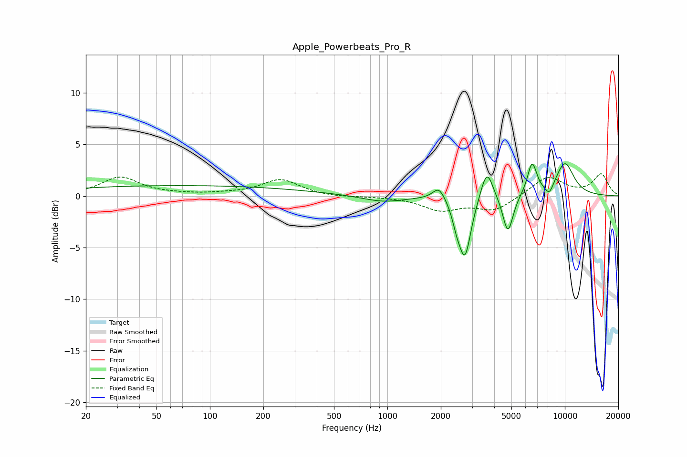

# Apple_Powerbeats_Pro_R
See [usage instructions](https://github.com/jaakkopasanen/AutoEq#usage) for more options and info.

### Parametric EQs
Apply preamp of -3.2 dB when using parametric equalizer.

|   # | Type    |   Fc (Hz) |    Q |   Gain (dB) |
|-----|---------|-----------|------|-------------|
|   1 | Peaking |        68 | 0.18 |         1   |
|   2 | Peaking |       948 | 1.19 |        -0.6 |
|   3 | Peaking |      1955 | 4.04 |         1.3 |
|   4 | Peaking |      2453 | 5.98 |        -1.3 |
|   5 | Peaking |      2735 | 4.11 |        -5.8 |
|   6 | Peaking |      3634 | 4.1  |         3   |
|   7 | Peaking |      4778 | 4.77 |        -3.8 |
|   8 | Peaking |      6538 | 5.1  |         3.1 |
|   9 | Peaking |      8174 | 5.4  |        -1.1 |
|  10 | Peaking |      9994 | 2.31 |         3.2 |

### Fixed Band EQs
When using fixed band (also called graphic) equalizer, apply preamp of **-2.2 dB** (if available) and set gains manually with these parameters.

|   # | Type    |   Fc (Hz) |    Q |   Gain (dB) |
|-----|---------|-----------|------|-------------|
|   1 | Peaking |        31 | 1.41 |         1.8 |
|   2 | Peaking |        62 | 1.41 |         0.1 |
|   3 | Peaking |       125 | 1.41 |         0.1 |
|   4 | Peaking |       250 | 1.41 |         1.6 |
|   5 | Peaking |       500 | 1.41 |        -0.1 |
|   6 | Peaking |      1000 | 1.41 |        -0   |
|   7 | Peaking |      2000 | 1.41 |        -1.3 |
|   8 | Peaking |      4000 | 1.41 |        -1.4 |
|   9 | Peaking |      8000 | 1.41 |         1.9 |
|  10 | Peaking |     16000 | 1.41 |         2.1 |

### Graphs

