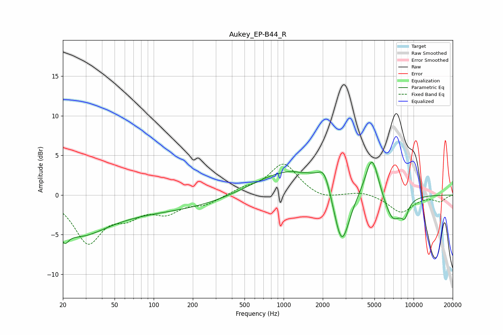

# Aukey_EP-B44_R
See [usage instructions](https://github.com/jaakkopasanen/AutoEq#usage) for more options and info.

### Parametric EQs
Apply preamp of -4.2 dB when using parametric equalizer.

|   # | Type    |   Fc (Hz) |    Q |   Gain (dB) |
|-----|---------|-----------|------|-------------|
|   1 | Peaking |        21 | 4.93 |        -1.5 |
|   2 | Peaking |        26 | 0.68 |        -3.4 |
|   3 | Peaking |        75 | 0.18 |        -2.1 |
|   4 | Peaking |      1234 | 0.46 |         3.5 |
|   5 | Peaking |      1355 | 5.97 |        -0.1 |
|   6 | Peaking |      2055 | 3.08 |         2.4 |
|   7 | Peaking |      2798 | 2.23 |        -8   |
|   8 | Peaking |      4793 | 2.75 |         5.3 |
|   9 | Peaking |      6929 | 1.96 |        -3.6 |
|  10 | Peaking |      8558 | 4.75 |        -1.7 |

### Fixed Band EQs
When using fixed band (also called graphic) equalizer, apply preamp of **-4.0 dB** (if available) and set gains manually with these parameters.

|   # | Type    |   Fc (Hz) |    Q |   Gain (dB) |
|-----|---------|-----------|------|-------------|
|   1 | Peaking |        31 | 1.41 |        -5.8 |
|   2 | Peaking |        62 | 1.41 |        -2.1 |
|   3 | Peaking |       125 | 1.41 |        -1.9 |
|   4 | Peaking |       250 | 1.41 |        -1   |
|   5 | Peaking |       500 | 1.41 |         0.7 |
|   6 | Peaking |      1000 | 1.41 |         3.9 |
|   7 | Peaking |      2000 | 1.41 |        -0.7 |
|   8 | Peaking |      4000 | 1.41 |         0.5 |
|   9 | Peaking |      8000 | 1.41 |        -2.2 |
|  10 | Peaking |     16000 | 1.41 |        -0.8 |

### Graphs

