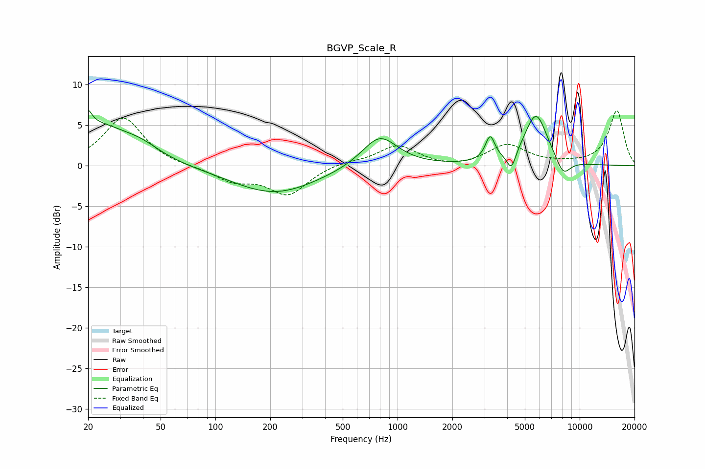

# BGVP_Scale_R
See [usage instructions](https://github.com/jaakkopasanen/AutoEq#usage) for more options and info.

### Parametric EQs
Apply preamp of -6.9 dB when using parametric equalizer.

|   # | Type    |   Fc (Hz) |    Q |   Gain (dB) |
|-----|---------|-----------|------|-------------|
|   1 | Peaking |        20 | 5.89 |         5.4 |
|   2 | Peaking |        20 | 6    |        -3.3 |
|   3 | Peaking |        23 | 0.82 |         4.7 |
|   4 | Peaking |        39 | 1.36 |         1.2 |
|   5 | Peaking |       211 | 0.6  |        -3.4 |
|   6 | Peaking |       798 | 1.45 |         3.9 |
|   7 | Peaking |      3224 | 5.45 |         3   |
|   8 | Peaking |      4221 | 5.6  |        -2.3 |
|   9 | Peaking |      5761 | 2.15 |         6.4 |
|  10 | Peaking |      8112 | 3.22 |        -2.2 |

### Fixed Band EQs
When using fixed band (also called graphic) equalizer, apply preamp of **-6.9 dB** (if available) and set gains manually with these parameters.

|   # | Type    |   Fc (Hz) |    Q |   Gain (dB) |
|-----|---------|-----------|------|-------------|
|   1 | Peaking |        31 | 1.41 |         6   |
|   2 | Peaking |        62 | 1.41 |        -0.1 |
|   3 | Peaking |       125 | 1.41 |        -1.7 |
|   4 | Peaking |       250 | 1.41 |        -3.5 |
|   5 | Peaking |       500 | 1.41 |         0.5 |
|   6 | Peaking |      1000 | 1.41 |         2.5 |
|   7 | Peaking |      2000 | 1.41 |        -0.4 |
|   8 | Peaking |      4000 | 1.41 |         2.5 |
|   9 | Peaking |      8000 | 1.41 |         0.2 |
|  10 | Peaking |     16000 | 1.41 |         6.8 |

### Graphs

