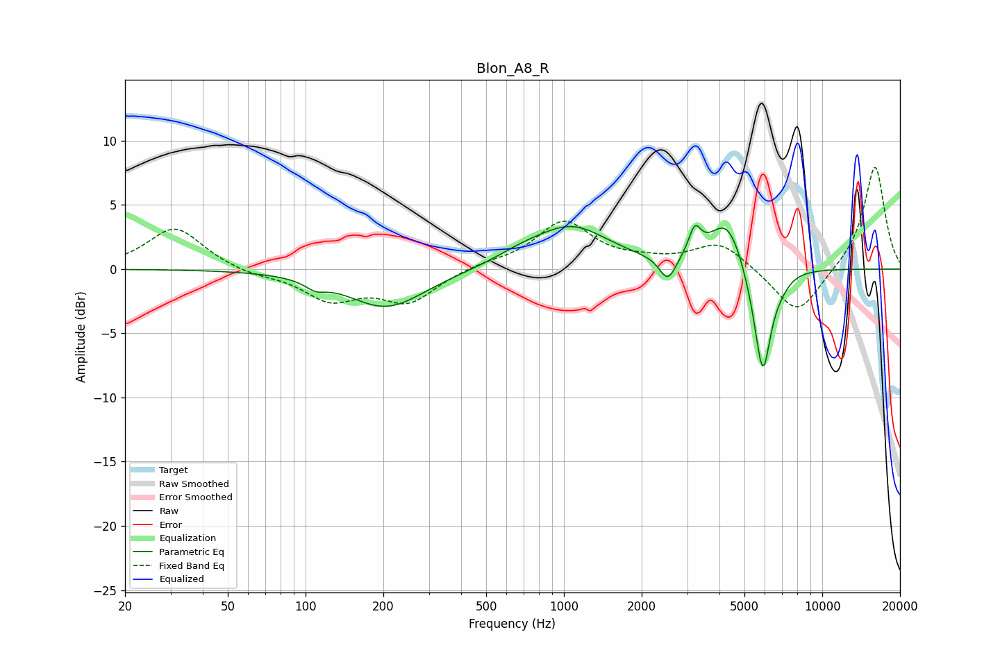

# Blon_A8_R
See [usage instructions](https://github.com/jaakkopasanen/AutoEq#usage) for more options and info.

### Parametric EQs
Apply preamp of -3.5 dB when using parametric equalizer.

|   # | Type    |   Fc (Hz) |    Q |   Gain (dB) |
|-----|---------|-----------|------|-------------|
|   1 | Peaking |       109 | 3.6  |        -0.6 |
|   2 | Peaking |       206 | 0.94 |        -3   |
|   3 | Peaking |       679 | 1.38 |         0.6 |
|   4 | Peaking |      1070 | 0.97 |         3.2 |
|   5 | Peaking |      2525 | 4.37 |        -2   |
|   6 | Peaking |      3212 | 6    |         2   |
|   7 | Peaking |      4305 | 1.96 |         4.2 |
|   8 | Peaking |      5469 | 2.33 |        -1.7 |
|   9 | Peaking |      5892 | 4.57 |        -7.4 |
|  10 | Peaking |      6822 | 3.51 |        -0.7 |

### Fixed Band EQs
When using fixed band (also called graphic) equalizer, apply preamp of **-8.0 dB** (if available) and set gains manually with these parameters.

|   # | Type    |   Fc (Hz) |    Q |   Gain (dB) |
|-----|---------|-----------|------|-------------|
|   1 | Peaking |        31 | 1.41 |         3.3 |
|   2 | Peaking |        62 | 1.41 |        -0.4 |
|   3 | Peaking |       125 | 1.41 |        -2.3 |
|   4 | Peaking |       250 | 1.41 |        -2.5 |
|   5 | Peaking |       500 | 1.41 |         0.4 |
|   6 | Peaking |      1000 | 1.41 |         3.6 |
|   7 | Peaking |      2000 | 1.41 |         0.4 |
|   8 | Peaking |      4000 | 1.41 |         2.1 |
|   9 | Peaking |      8000 | 1.41 |        -3.7 |
|  10 | Peaking |     16000 | 1.41 |         8.1 |

### Graphs

