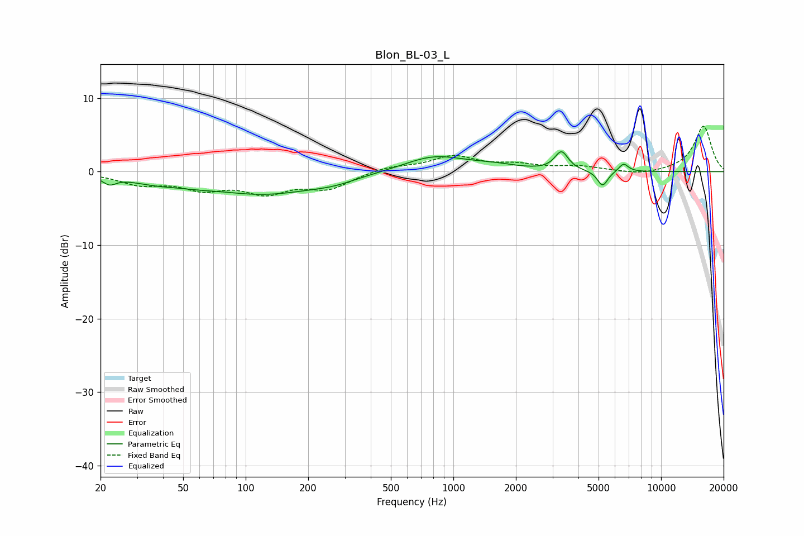

# Blon_BL-03_L
See [usage instructions](https://github.com/jaakkopasanen/AutoEq#usage) for more options and info.

### Parametric EQs
Apply preamp of -2.8 dB when using parametric equalizer.

|   # | Type    |   Fc (Hz) |    Q |   Gain (dB) |
|-----|---------|-----------|------|-------------|
|   1 | Peaking |        22 | 4.44 |        -1   |
|   2 | Peaking |        37 | 1.07 |        -1   |
|   3 | Peaking |        58 | 1.88 |        -0.3 |
|   4 | Peaking |       122 | 0.52 |        -2.9 |
|   5 | Peaking |       267 | 1.36 |        -0.6 |
|   6 | Peaking |       811 | 0.94 |         2.2 |
|   7 | Peaking |      1576 | 1.31 |         0.6 |
|   8 | Peaking |      3313 | 4.43 |         2.5 |
|   9 | Peaking |      5229 | 5.48 |        -2.1 |
|  10 | Peaking |      6595 | 5.99 |         1.1 |

### Fixed Band EQs
When using fixed band (also called graphic) equalizer, apply preamp of **-6.3 dB** (if available) and set gains manually with these parameters.

|   # | Type    |   Fc (Hz) |    Q |   Gain (dB) |
|-----|---------|-----------|------|-------------|
|   1 | Peaking |        31 | 1.41 |        -1.5 |
|   2 | Peaking |        62 | 1.41 |        -2   |
|   3 | Peaking |       125 | 1.41 |        -2.5 |
|   4 | Peaking |       250 | 1.41 |        -2.1 |
|   5 | Peaking |       500 | 1.41 |         0.7 |
|   6 | Peaking |      1000 | 1.41 |         2   |
|   7 | Peaking |      2000 | 1.41 |         0.8 |
|   8 | Peaking |      4000 | 1.41 |         0.6 |
|   9 | Peaking |      8000 | 1.41 |        -0.5 |
|  10 | Peaking |     16000 | 1.41 |         6.2 |

### Graphs

