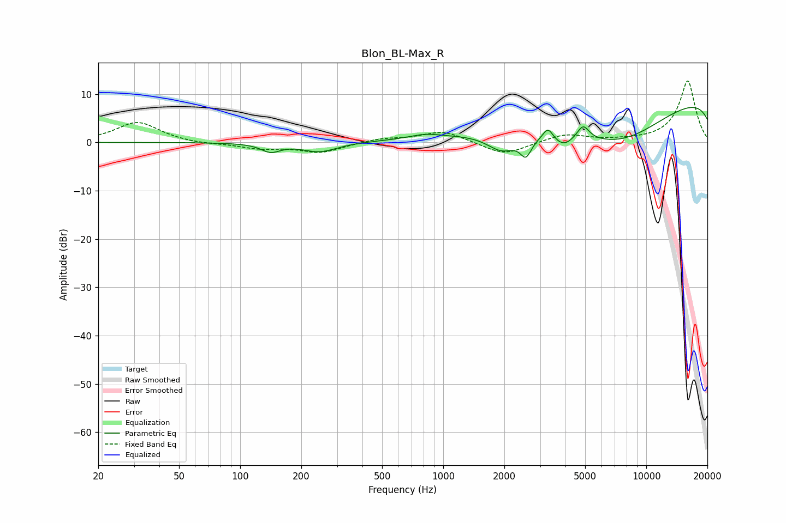

# Blon_BL-Max_R
See [usage instructions](https://github.com/jaakkopasanen/AutoEq#usage) for more options and info.

### Parametric EQs
Apply preamp of -7.3 dB when using parametric equalizer.

|   # | Type    |   Fc (Hz) |    Q |   Gain (dB) |
|-----|---------|-----------|------|-------------|
|   1 | Peaking |       141 | 3.01 |        -1.7 |
|   2 | Peaking |       247 | 1.65 |        -2   |
|   3 | Peaking |       813 | 1.96 |         0.8 |
|   4 | Peaking |      1942 | 1.91 |        -3.7 |
|   5 | Peaking |      2554 | 5.16 |        -3.7 |
|   6 | Peaking |      3278 | 5.93 |         2.5 |
|   7 | Peaking |      3915 | 2.84 |        -2.2 |
|   8 | Peaking |      4883 | 4.68 |         3   |
|   9 | Peaking |      7490 | 0.37 |       -14.4 |
|  10 | Peaking |     10000 | 0.18 |        15.7 |

### Fixed Band EQs
When using fixed band (also called graphic) equalizer, apply preamp of **-12.8 dB** (if available) and set gains manually with these parameters.

|   # | Type    |   Fc (Hz) |    Q |   Gain (dB) |
|-----|---------|-----------|------|-------------|
|   1 | Peaking |        31 | 1.41 |         4.2 |
|   2 | Peaking |        62 | 1.41 |        -0.4 |
|   3 | Peaking |       125 | 1.41 |        -1.2 |
|   4 | Peaking |       250 | 1.41 |        -2   |
|   5 | Peaking |       500 | 1.41 |         0.8 |
|   6 | Peaking |      1000 | 1.41 |         2.4 |
|   7 | Peaking |      2000 | 1.41 |        -2.7 |
|   8 | Peaking |      4000 | 1.41 |         1.7 |
|   9 | Peaking |      8000 | 1.41 |         0.2 |
|  10 | Peaking |     16000 | 1.41 |        12.8 |

### Graphs

