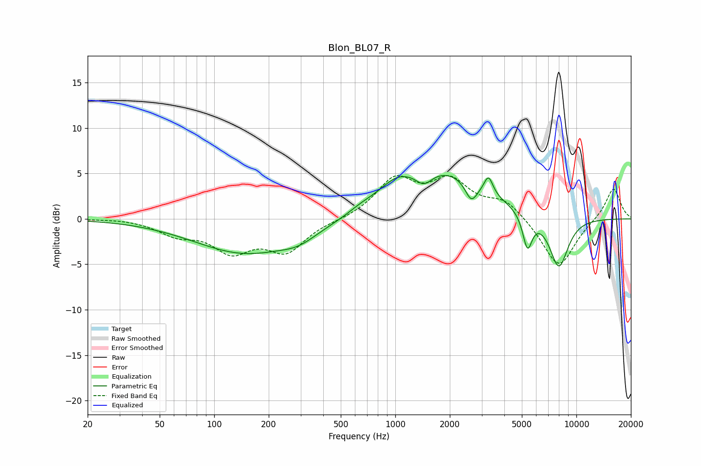

# Blon_BL07_R
See [usage instructions](https://github.com/jaakkopasanen/AutoEq#usage) for more options and info.

### Parametric EQs
Apply preamp of -4.9 dB when using parametric equalizer.

|   # | Type    |   Fc (Hz) |    Q |   Gain (dB) |
|-----|---------|-----------|------|-------------|
|   1 | Peaking |       150 | 0.5  |        -3.8 |
|   2 | Peaking |       292 | 1.46 |        -0.9 |
|   3 | Peaking |       648 | 1.86 |         0.5 |
|   4 | Peaking |      1017 | 1.37 |         2.1 |
|   5 | Peaking |      1439 | 3.17 |        -1.3 |
|   6 | Peaking |      1920 | 0.62 |         4.9 |
|   7 | Peaking |      2629 | 4.19 |        -2.2 |
|   8 | Peaking |      3271 | 5.99 |         2   |
|   9 | Peaking |      5369 | 5.32 |        -3.8 |
|  10 | Peaking |      7999 | 2.49 |        -5.6 |

### Fixed Band EQs
When using fixed band (also called graphic) equalizer, apply preamp of **-4.9 dB** (if available) and set gains manually with these parameters.

|   # | Type    |   Fc (Hz) |    Q |   Gain (dB) |
|-----|---------|-----------|------|-------------|
|   1 | Peaking |        31 | 1.41 |         0.1 |
|   2 | Peaking |        62 | 1.41 |        -1.5 |
|   3 | Peaking |       125 | 1.41 |        -3.2 |
|   4 | Peaking |       250 | 1.41 |        -3.4 |
|   5 | Peaking |       500 | 1.41 |        -0.1 |
|   6 | Peaking |      1000 | 1.41 |         4.2 |
|   7 | Peaking |      2000 | 1.41 |         3.8 |
|   8 | Peaking |      4000 | 1.41 |         1.9 |
|   9 | Peaking |      8000 | 1.41 |        -5.5 |
|  10 | Peaking |     16000 | 1.41 |         3.5 |

### Graphs

