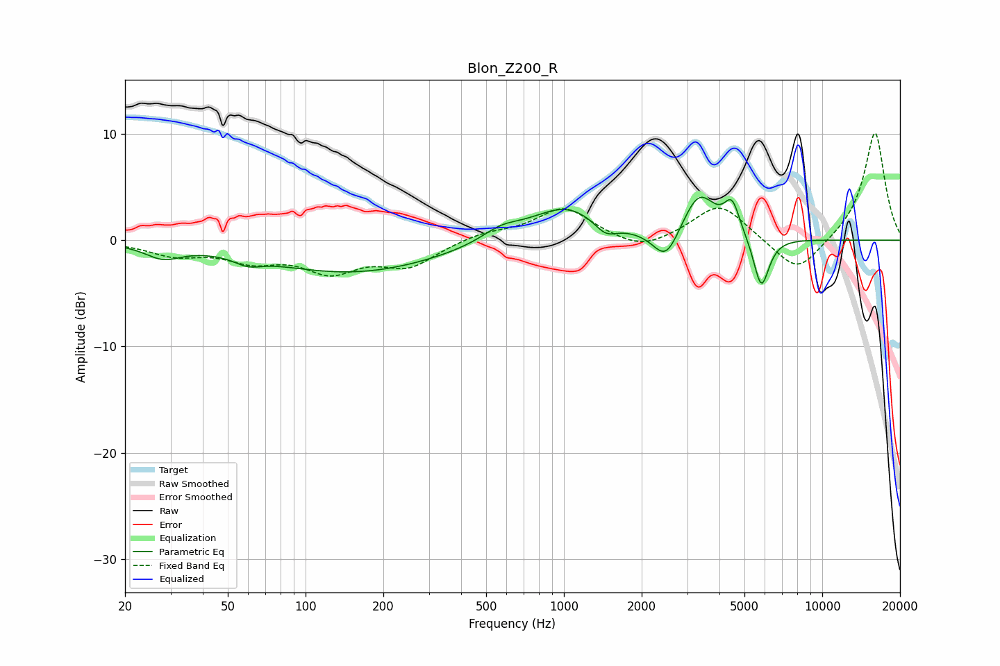

# Blon_Z200_R
See [usage instructions](https://github.com/jaakkopasanen/AutoEq#usage) for more options and info.

### Parametric EQs
Apply preamp of -4.1 dB when using parametric equalizer.

|   # | Type    |   Fc (Hz) |    Q |   Gain (dB) |
|-----|---------|-----------|------|-------------|
|   1 | Peaking |        28 | 2.07 |        -1.3 |
|   2 | Peaking |        60 | 2.75 |        -0.7 |
|   3 | Peaking |       152 | 0.42 |        -3   |
|   4 | Peaking |       570 | 1.88 |         1.1 |
|   5 | Peaking |      1020 | 0.99 |         3.3 |
|   6 | Peaking |      1448 | 3.11 |        -1.3 |
|   7 | Peaking |      2485 | 2.81 |        -3   |
|   8 | Peaking |      3336 | 2.21 |         4.3 |
|   9 | Peaking |      4476 | 4.62 |         3   |
|  10 | Peaking |      5811 | 4.59 |        -4.9 |

### Fixed Band EQs
When using fixed band (also called graphic) equalizer, apply preamp of **-10.2 dB** (if available) and set gains manually with these parameters.

|   # | Type    |   Fc (Hz) |    Q |   Gain (dB) |
|-----|---------|-----------|------|-------------|
|   1 | Peaking |        31 | 1.41 |        -1.2 |
|   2 | Peaking |        62 | 1.41 |        -1.6 |
|   3 | Peaking |       125 | 1.41 |        -2.7 |
|   4 | Peaking |       250 | 1.41 |        -2.3 |
|   5 | Peaking |       500 | 1.41 |         0.7 |
|   6 | Peaking |      1000 | 1.41 |         3   |
|   7 | Peaking |      2000 | 1.41 |        -1.2 |
|   8 | Peaking |      4000 | 1.41 |         3.5 |
|   9 | Peaking |      8000 | 1.41 |        -3.3 |
|  10 | Peaking |     16000 | 1.41 |        10.3 |

### Graphs

