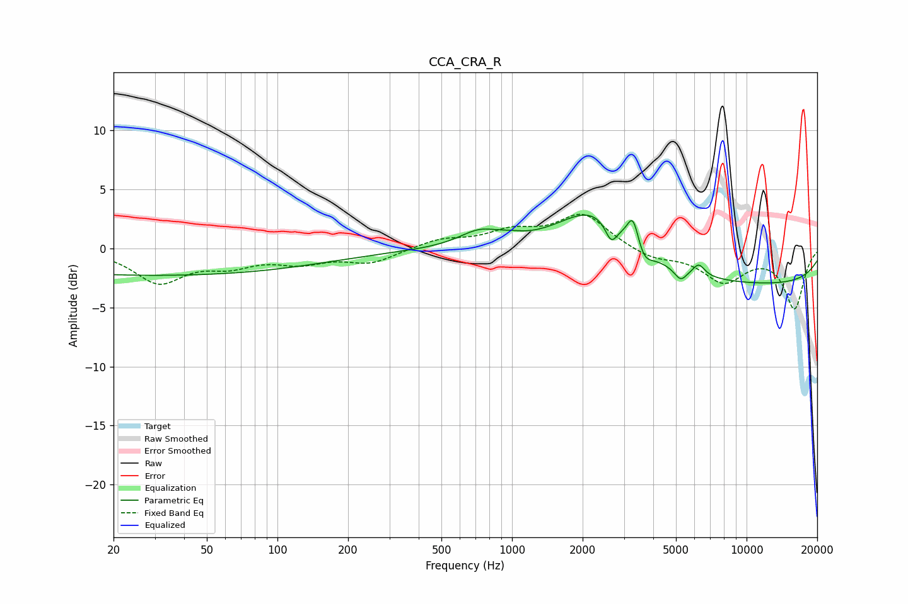

# CCA_CRA_R
See [usage instructions](https://github.com/jaakkopasanen/AutoEq#usage) for more options and info.

### Parametric EQs
Apply preamp of -2.9 dB when using parametric equalizer.

|   # | Type    |   Fc (Hz) |    Q |   Gain (dB) |
|-----|---------|-----------|------|-------------|
|   1 | Peaking |        30 | 0.18 |        -2.3 |
|   2 | Peaking |       729 | 1.59 |         1.3 |
|   3 | Peaking |       989 | 2.76 |         0.2 |
|   4 | Peaking |      2246 | 0.89 |         4.5 |
|   5 | Peaking |      2648 | 5.6  |        -1.7 |
|   6 | Peaking |      3282 | 5.74 |         2.5 |
|   7 | Peaking |      3639 | 4.11 |        -1.3 |
|   8 | Peaking |      5232 | 5.3  |        -1   |
|   9 | Peaking |      6250 | 5.31 |         1   |
|  10 | Peaking |     10000 | 0.18 |        -3.1 |

### Fixed Band EQs
When using fixed band (also called graphic) equalizer, apply preamp of **-3.0 dB** (if available) and set gains manually with these parameters.

|   # | Type    |   Fc (Hz) |    Q |   Gain (dB) |
|-----|---------|-----------|------|-------------|
|   1 | Peaking |        31 | 1.41 |        -2.8 |
|   2 | Peaking |        62 | 1.41 |        -1.2 |
|   3 | Peaking |       125 | 1.41 |        -1   |
|   4 | Peaking |       250 | 1.41 |        -1.2 |
|   5 | Peaking |       500 | 1.41 |         0.7 |
|   6 | Peaking |      1000 | 1.41 |         1.3 |
|   7 | Peaking |      2000 | 1.41 |         2.9 |
|   8 | Peaking |      4000 | 1.41 |        -0.8 |
|   9 | Peaking |      8000 | 1.41 |        -2.7 |
|  10 | Peaking |     16000 | 1.41 |        -5   |

### Graphs

