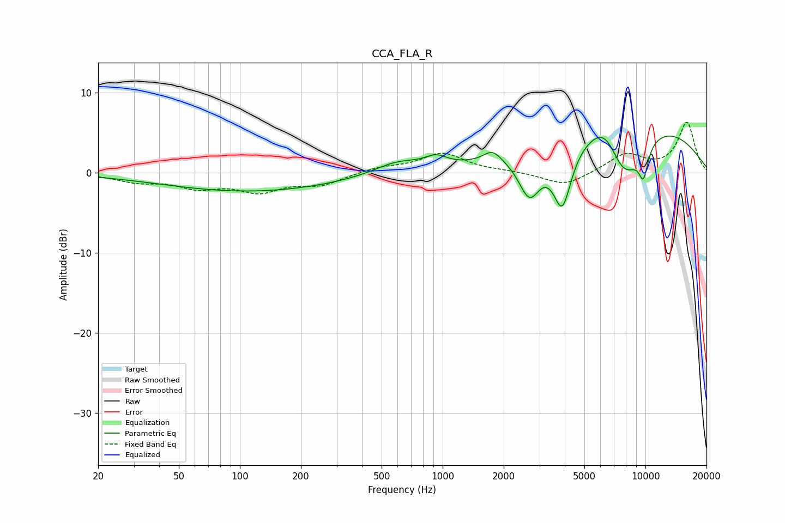

# CCA_FLA_R
See [usage instructions](https://github.com/jaakkopasanen/AutoEq#usage) for more options and info.

### Parametric EQs
Apply preamp of -4.7 dB when using parametric equalizer.

|   # | Type    |   Fc (Hz) |    Q |   Gain (dB) |
|-----|---------|-----------|------|-------------|
|   1 | Peaking |       113 | 0.33 |        -2.3 |
|   2 | Peaking |       596 | 1.24 |         1.5 |
|   3 | Peaking |       926 | 2.54 |         1.2 |
|   4 | Peaking |      1761 | 3.23 |         1.5 |
|   5 | Peaking |      2681 | 2.54 |        -5.6 |
|   6 | Peaking |      3889 | 3.01 |        -7.9 |
|   7 | Peaking |      6386 | 1.78 |         3.4 |
|   8 | Peaking |      7809 | 1.33 |        -8   |
|   9 | Peaking |      8177 | 0.3  |         7.4 |
|  10 | Peaking |      9775 | 5.26 |        -3.7 |

### Fixed Band EQs
When using fixed band (also called graphic) equalizer, apply preamp of **-6.4 dB** (if available) and set gains manually with these parameters.

|   # | Type    |   Fc (Hz) |    Q |   Gain (dB) |
|-----|---------|-----------|------|-------------|
|   1 | Peaking |        31 | 1.41 |        -1   |
|   2 | Peaking |        62 | 1.41 |        -1.6 |
|   3 | Peaking |       125 | 1.41 |        -2.1 |
|   4 | Peaking |       250 | 1.41 |        -1.4 |
|   5 | Peaking |       500 | 1.41 |         0.6 |
|   6 | Peaking |      1000 | 1.41 |         2.4 |
|   7 | Peaking |      2000 | 1.41 |         0.2 |
|   8 | Peaking |      4000 | 1.41 |        -1.7 |
|   9 | Peaking |      8000 | 1.41 |         2.3 |
|  10 | Peaking |     16000 | 1.41 |         6.3 |

### Graphs

