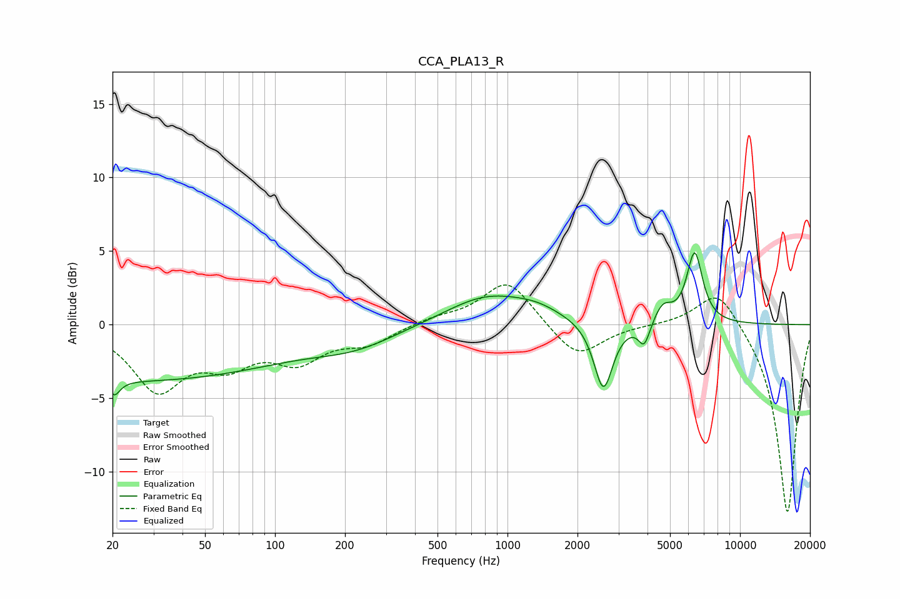

# CCA_PLA13_R
See [usage instructions](https://github.com/jaakkopasanen/AutoEq#usage) for more options and info.

### Parametric EQs
Apply preamp of -5.0 dB when using parametric equalizer.

|   # | Type    |   Fc (Hz) |    Q |   Gain (dB) |
|-----|---------|-----------|------|-------------|
|   1 | Peaking |        20 | 5.99 |         2.8 |
|   2 | Peaking |        20 | 5.92 |        -3.8 |
|   3 | Peaking |        24 | 0.2  |        -3.8 |
|   4 | Peaking |       222 | 0.77 |        -1.1 |
|   5 | Peaking |       818 | 0.79 |         2   |
|   6 | Peaking |      1346 | 1.37 |         0.6 |
|   7 | Peaking |      2584 | 3.49 |        -4.7 |
|   8 | Peaking |      3873 | 5.72 |        -1.6 |
|   9 | Peaking |      4658 | 3.66 |         1.2 |
|  10 | Peaking |      6382 | 4.04 |         4.8 |

### Fixed Band EQs
When using fixed band (also called graphic) equalizer, apply preamp of **-2.8 dB** (if available) and set gains manually with these parameters.

|   # | Type    |   Fc (Hz) |    Q |   Gain (dB) |
|-----|---------|-----------|------|-------------|
|   1 | Peaking |        31 | 1.41 |        -4.2 |
|   2 | Peaking |        62 | 1.41 |        -2.2 |
|   3 | Peaking |       125 | 1.41 |        -2.2 |
|   4 | Peaking |       250 | 1.41 |        -1.1 |
|   5 | Peaking |       500 | 1.41 |         0.4 |
|   6 | Peaking |      1000 | 1.41 |         3.1 |
|   7 | Peaking |      2000 | 1.41 |        -2.3 |
|   8 | Peaking |      4000 | 1.41 |         0   |
|   9 | Peaking |      8000 | 1.41 |         2.7 |
|  10 | Peaking |     16000 | 1.41 |       -12.9 |

### Graphs

