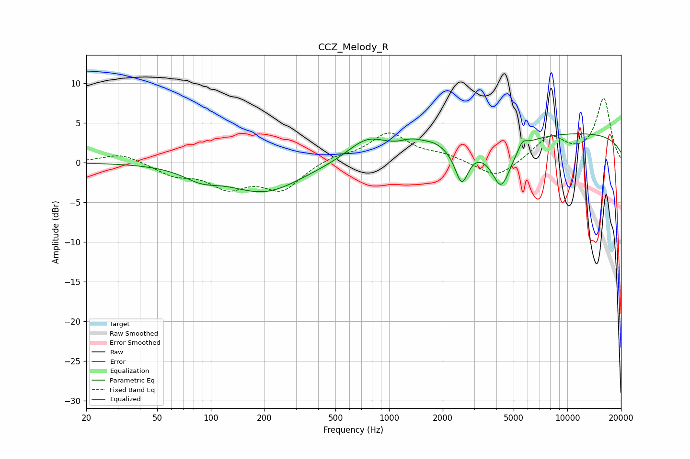

# CCZ_Melody_R
See [usage instructions](https://github.com/jaakkopasanen/AutoEq#usage) for more options and info.

### Parametric EQs
Apply preamp of -3.7 dB when using parametric equalizer.

|   # | Type    |   Fc (Hz) |    Q |   Gain (dB) |
|-----|---------|-----------|------|-------------|
|   1 | Peaking |        88 | 1.44 |        -1.3 |
|   2 | Peaking |       200 | 0.69 |        -3.7 |
|   3 | Peaking |       755 | 1.24 |         2.9 |
|   4 | Peaking |      1348 | 2    |         1.2 |
|   5 | Peaking |      1800 | 2.18 |         0.8 |
|   6 | Peaking |      2556 | 3.81 |        -4.4 |
|   7 | Peaking |      4191 | 5.56 |        -0.3 |
|   8 | Peaking |      4268 | 2.38 |        -5.5 |
|   9 | Peaking |      5610 | 5.73 |         1   |
|  10 | Peaking |     10000 | 0.18 |         3.7 |

### Fixed Band EQs
When using fixed band (also called graphic) equalizer, apply preamp of **-8.1 dB** (if available) and set gains manually with these parameters.

|   # | Type    |   Fc (Hz) |    Q |   Gain (dB) |
|-----|---------|-----------|------|-------------|
|   1 | Peaking |        31 | 1.41 |         1.2 |
|   2 | Peaking |        62 | 1.41 |        -1.4 |
|   3 | Peaking |       125 | 1.41 |        -2.8 |
|   4 | Peaking |       250 | 1.41 |        -3.3 |
|   5 | Peaking |       500 | 1.41 |         0.8 |
|   6 | Peaking |      1000 | 1.41 |         3.6 |
|   7 | Peaking |      2000 | 1.41 |         0.8 |
|   8 | Peaking |      4000 | 1.41 |        -2.2 |
|   9 | Peaking |      8000 | 1.41 |         3.1 |
|  10 | Peaking |     16000 | 1.41 |         8   |

### Graphs

