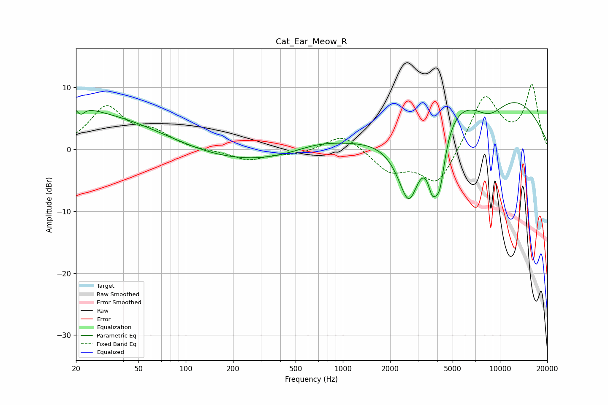

# Cat_Ear_Meow_R
See [usage instructions](https://github.com/jaakkopasanen/AutoEq#usage) for more options and info.

### Parametric EQs
Apply preamp of -7.6 dB when using parametric equalizer.

|   # | Type    |   Fc (Hz) |    Q |   Gain (dB) |
|-----|---------|-----------|------|-------------|
|   1 | Peaking |        20 | 1.71 |         1.5 |
|   2 | Peaking |        21 | 5.29 |        -1.6 |
|   3 | Peaking |        23 | 0.24 |         6.2 |
|   4 | Peaking |       195 | 0.29 |        -2.6 |
|   5 | Peaking |       689 | 0.85 |         1.4 |
|   6 | Peaking |      2631 | 1.72 |       -13.2 |
|   7 | Peaking |      3715 | 4.71 |        -5.4 |
|   8 | Peaking |      4138 | 3.83 |        -8.6 |
|   9 | Peaking |      7826 | 0.29 |        12.1 |
|  10 | Peaking |      8504 | 1.04 |        -5.5 |

### Fixed Band EQs
When using fixed band (also called graphic) equalizer, apply preamp of **-10.6 dB** (if available) and set gains manually with these parameters.

|   # | Type    |   Fc (Hz) |    Q |   Gain (dB) |
|-----|---------|-----------|------|-------------|
|   1 | Peaking |        31 | 1.41 |         6.6 |
|   2 | Peaking |        62 | 1.41 |         2.3 |
|   3 | Peaking |       125 | 1.41 |        -0.2 |
|   4 | Peaking |       250 | 1.41 |        -1.7 |
|   5 | Peaking |       500 | 1.41 |        -0.7 |
|   6 | Peaking |      1000 | 1.41 |         2.7 |
|   7 | Peaking |      2000 | 1.41 |        -3.4 |
|   8 | Peaking |      4000 | 1.41 |        -6   |
|   9 | Peaking |      8000 | 1.41 |         8.8 |
|  10 | Peaking |     16000 | 1.41 |        10.1 |

### Graphs

