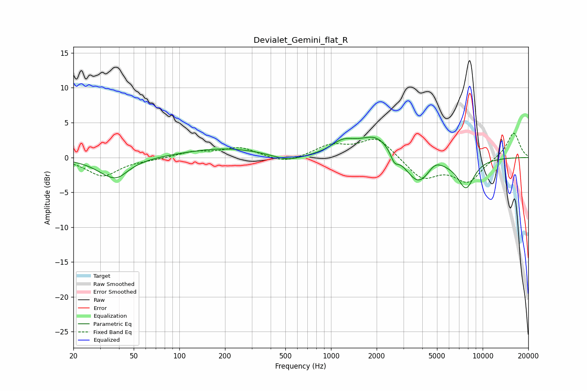

# Devialet_Gemini_flat_R
See [usage instructions](https://github.com/jaakkopasanen/AutoEq#usage) for more options and info.

### Parametric EQs
Apply preamp of -3.0 dB when using parametric equalizer.

|   # | Type    |   Fc (Hz) |    Q |   Gain (dB) |
|-----|---------|-----------|------|-------------|
|   1 | Peaking |        36 | 1.35 |        -2.6 |
|   2 | Peaking |        40 | 2.66 |        -0.6 |
|   3 | Peaking |       200 | 0.53 |         1.3 |
|   4 | Peaking |       520 | 1.38 |        -1   |
|   5 | Peaking |      1199 | 1.79 |         1.7 |
|   6 | Peaking |      2005 | 1.27 |         3.2 |
|   7 | Peaking |      2620 | 5.7  |        -1.4 |
|   8 | Peaking |      3776 | 1.58 |        -4.3 |
|   9 | Peaking |      4828 | 2.62 |         1.4 |
|  10 | Peaking |      7757 | 2.38 |        -4.1 |

### Fixed Band EQs
When using fixed band (also called graphic) equalizer, apply preamp of **-3.6 dB** (if available) and set gains manually with these parameters.

|   # | Type    |   Fc (Hz) |    Q |   Gain (dB) |
|-----|---------|-----------|------|-------------|
|   1 | Peaking |        31 | 1.41 |        -2.6 |
|   2 | Peaking |        62 | 1.41 |        -0.2 |
|   3 | Peaking |       125 | 1.41 |         0.8 |
|   4 | Peaking |       250 | 1.41 |         1.4 |
|   5 | Peaking |       500 | 1.41 |        -0.9 |
|   6 | Peaking |      1000 | 1.41 |         1.6 |
|   7 | Peaking |      2000 | 1.41 |         2.9 |
|   8 | Peaking |      4000 | 1.41 |        -3   |
|   9 | Peaking |      8000 | 1.41 |        -3.4 |
|  10 | Peaking |     16000 | 1.41 |         3.7 |

### Graphs

